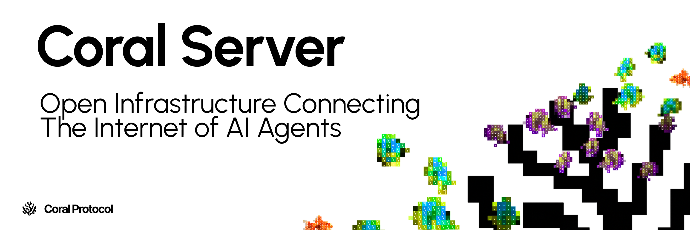

[](https://deepwiki.com/Coral-Protocol/coral-server)

> [!WARNING]
> 
> This readme and connected documentation are a work in progress.


<br/>
<div align="center">

**[How to Run](#how-to-run)** ┃ **[Configuration](#configuration)** ┃ **[Contributing](#contribution-guidelines)**

</div>
<br/>

## How to Run

### Using Gradle

Clone this repository, and in that folder run:
```bash
./gradlew run
```

### Using Docker

A coral-server docker image is available on ghcr.io:

```bash
docker run \
  -p 5555:5555 \
  -e CONFIG_FILE_PATH=/config/config.toml
  -v /path/to/your/config.toml:/config/config.toml
  -v /var/run/docker.sock:/var/run/docker.sock # docker in docker
  ghcr.io/coral-protocol/coral-server
```

> [!WARNING]
> The Coral Server docker image is *very* minimal, which means the executable runtime will **not** work. All agents must use the Docker runtime, which means you **must** give your server container access to your host's docker socket.
>
> See [here](https://docs.coralprotocol.org/setup/coral-server-applications#docker-recommended) for more information on giving your docker container access to Docker.


## Configuration

Authentication keys are required to be configured in a `config.toml` file, e.g.:

```toml
[auth]
keys = ["my-auth-key"]
```

The server must be given an environment variable `CONFIG_FILE_PATH` pointing to the location of the config file.
Alternatively, you can provide configuration via command-line arguments. For example, to set the authentication keys to `["dev"]`, run the server with:

```bash
./gradlew run --args="--auth.keys=dev"
```

### Command-line Property Mapping

The server uses [Hoplite](https://github.com/sksamuel/hoplite) for configuration. When using command-line arguments:

- **Nested Properties:** Use dot notation to reach nested configuration blocks. For example, the `[auth]` block's `keys` property becomes `--auth.keys`.
- **Collections (Lists/Sets):** Provide multiple values separated by commas. For example, `--auth.keys=key1,key2` will be parsed into a set containing both keys.
- **Data Types:** Simple types (strings, booleans, numbers) are automatically converted. Booleans can be set as `--some.flag=true`.

Examples:

| TOML Config | Command-line Argument                  |
| :--- |:---------------------------------------|
| `[auth]`<br/>`keys = ["a", "b"]` | `--auth.keys=a,b`                      |
| `[network]`<br/>`bindPort = 8080` | `--network.bind-port=8080`             |
| `[registry]`<br/>`includeDebugAgents = true` | `--registry.include-debug-agents=true` |

(camel-case forms for still work for command-line args)

## Contribution Guidelines

We welcome contributions! Email us at [hello@coralos.ai](mailto:hello@coralos.au) or join our Discord [here](https://discord.gg/rMQc2uWXhj) to connect with the developer team. Feel free to open issues or submit pull requests.

Thanks for checking out the project, we hope you like it!

### Development
IntelliJ IDEA is recommended for development. The project uses Gradle as the build system.

To clone and import the project:
Go to File > New > Project from Version Control > Git.
enter `git@github.com:Coral-Protocol/coral-server.git`
Click Clone.

### Running from IntelliJ IDEA
You can click the play button next to the main method in the `Main.kt` file to run the server directly from IntelliJ IDEA.

