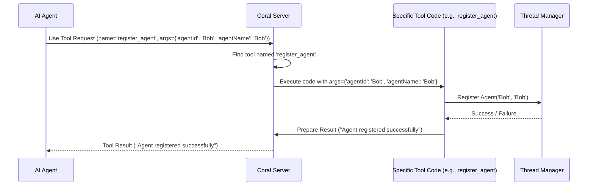

# Chapter 1: Tool (MCP Concept)

Welcome to the `coral-server` tutorial! This project helps different computer programs, especially Artificial Intelligence (AI) agents, talk and work together.

Imagine you have several AI assistants, maybe one that's good at writing emails and another that's good at searching the web. How can they collaborate on a task? The `coral-server` acts like a central hub or a workshop where these agents can connect and use shared capabilities.

But just connecting isn't enough. Agents need to *do* things. For example, a new agent joining the system needs to announce its presence. An agent might need to send a message to another agent, or perhaps create a new conversation "thread". How does an agent tell the server, "Hey, I want to do *this specific action*"?

This is where the concept of a **Tool** comes in!

## What is a Tool?

Think of the `coral-server` as a fully equipped workshop. A **Tool** is like a specific piece of equipment in that workshop – a drill, a saw, a wrench, or maybe even a fancy 3D printer.

Each Tool represents a specific **capability** or **action** that the server can perform for a client (like an AI agent).

Just like a real tool in a workshop, each Tool in `coral-server` has:

1.  **A Name:** A unique identifier so clients know which tool to ask for (e.g., `register_agent`, `send_message`).
2.  **A Description:** A short explanation of what the tool does (e.g., "Register an agent in the system", "Send a message to a thread"). This helps agents (and the humans guiding them) understand the tool's purpose.
3.  **Defined Inputs (Schema):** Specifies exactly what information the tool needs to do its job (e.g., to register an agent, it needs the `agentId` and `agentName`; to send a message, it needs the `threadId`, `senderId`, and `content`).

When a client wants to perform an action, it doesn't need to know the complex details of *how* the server does it. It just needs to:

1.  Choose the right **Tool** by its `name`.
2.  Provide the required **inputs** (arguments).
3.  Ask the server to use the tool.

The server then takes the request, finds the corresponding tool, executes its function using the provided inputs, and usually sends back a result (like "Success!" or "Error: Something went wrong").

## Example: Registering an Agent

Let's look at a concrete example. When a new AI agent connects to the `coral-server`, it should probably register itself so others know it exists. There's a tool specifically for this: `register_agent`.

Here's a simplified look at how this tool is defined in the server code (from `RegisterAgentTool.kt`):

```kotlin
// In the server setup code...

// Add the 'register_agent' tool
addTool(
    // 1. The unique name clients use
    name = "register_agent",

    // 2. What this tool does
    description = "Register an agent in the system...",

    // 3. What information the tool needs
    inputSchema = Tool.Input(
        // ... details about expected inputs ...
        required = listOf("agentId", "agentName") // Must provide these!
    )
) { request -> // 4. The actual code to run!
    // This block executes when a client calls 'register_agent'
    // It uses the inputs from the 'request' to register the agent.
    // ... (implementation details) ...

    // Finally, it returns a result back to the client.
    CallToolResult(content = listOf(TextContent("Agent registered...")))
}
```

Let's break this down:

1.  `name = "register_agent"`: This is the unique identifier. An AI agent would say, "I want to use the `register_agent` tool."
2.  `description = "Register an agent..."`: This tells the agent (or its user) what this tool is for.
3.  `inputSchema = Tool.Input(...)`: This part defines the *required* information. Here, it specifies that the client *must* provide an `agentId` (a unique ID for the agent) and an `agentName` (a display name). We'll learn more about inputs in the next chapter: [Tool Inputs (`*Input` classes)](02_tool_inputs____input__classes__.md).
4.  `{ request -> ... }`: This is the actual code block (a "lambda function") that the server runs when the `register_agent` tool is called. It takes the `request` (which contains the `agentId` and `agentName` provided by the client), performs the registration logic (likely interacting with the [Thread Manager (`ThreadManager`)](05_thread_manager___threadmanager__.md)), and then creates a `CallToolResult` to send back to the client.

So, an agent wanting to register might send a request like: "Use tool `register_agent` with `agentId='email-sorter-bot'` and `agentName='Email Sorter Bot'`". The server would then run the code associated with `register_agent`, using these inputs.

## How it Works Under the Hood (Simplified)

When a client asks the server to use a tool, here's a simplified sequence of events:



1.  **Request:** The client sends a message to the [MCP Server (`Server`)](03_mcp_server___server___.md) asking to use a tool by its `name` and providing the necessary `arguments`.
2.  **Lookup:** The server looks up the tool definition based on the provided `name`.
3.  **Execution:** The server executes the code block (the lambda function) associated with that tool, passing in the arguments from the client's request.
4.  **Action:** The tool's code performs its specific action. For `register_agent`, this involves calling the `ThreadManager.registerAgent` function (part of the [Thread Manager (`ThreadManager`)](05_thread_manager___threadmanager__.md)) to store the new agent's details. Other tools might send messages, create threads, etc.
5.  **Result:** The tool's code generates a result message (e.g., confirming success or reporting an error).
6.  **Response:** The server packages this result and sends it back to the client who made the original request.

The beauty of this is that the client only needs to know the tool's name and inputs, not the internal steps the server takes.

## Adding Tools to the Server

In the `coral-server` project, tools are typically defined in their own files (like `RegisterAgentTool.kt`, `SendMessageTool.kt`, etc.) as extension functions on the `Server` class.

A central file, `ThreadToolsRegistry.kt`, then calls these functions to add all the available tools to the server instance when it starts up.

```kotlin
// Simplified view from ThreadToolsRegistry.kt
package org.coralprotocol.agentfuzzyp2ptools.tools

import io.modelcontextprotocol.kotlin.sdk.server.Server

/**
 * Add all the tools to the server.
 */
fun Server.addThreadTools() {
    addRegisterAgentTool() // Calls the function shown earlier
    addListAgentsTool()
    addCreateThreadTool()
    addSendMessageTool()
    // ... and adds all other tools ...
}
```

This keeps the tool definitions organized and makes it easy to see all the capabilities the server offers.

## Conclusion

You've now learned about the fundamental concept of a **Tool** in the `coral-server` project. Tools are the building blocks of the server's functionality, representing named, described actions with specific input requirements. They allow clients (like AI agents) to request actions from the server in a standardized way, much like using different tools from a workshop.

We saw how a tool like `register_agent` is defined with a name, description, input schema, and the actual code to execute. We also got a glimpse of how the server handles a tool request.

But how exactly are the inputs for these tools structured and handled? That's what we'll dive into next!

**Next Chapter:** [Tool Inputs (`*Input` classes)](02_tool_inputs____input__classes__.md)

---
