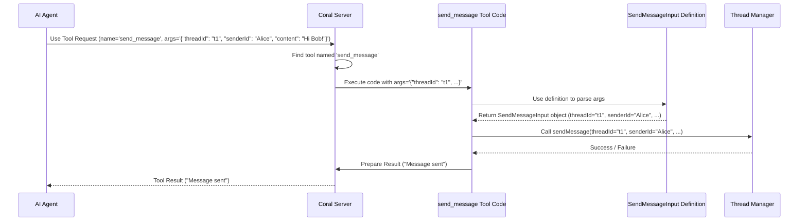

# Chapter 2: Tool Inputs (`*Input` classes)

In the [previous chapter](01_tool__mcp_concept__.md), we learned about **Tools** – the specific actions or capabilities the `coral-server` offers, like `register_agent` or `send_message`. We saw that each tool needs specific pieces of information (inputs) to do its job.

But how does the server *know* exactly what information to expect for each tool? And how does it easily get that information from the client's request?

Imagine you want to send a postcard. You can't just hand the postal worker the card and say "send this!". You need to provide specific information in specific places: a recipient address, a message, and your return address. If any piece is missing or in the wrong format, the postcard won't get delivered correctly.

Tools work the same way. The `send_message` tool needs to know *which* conversation (thread) the message belongs to, *who* is sending it, and *what* the message actually says.

This is where **Tool Inputs (`*Input` classes)** come in!

## What are `*Input` Classes?

Think of `*Input` classes as **standardized digital forms** for each tool.

For every tool that requires inputs, we define a special, simple data structure (a "data class" in Kotlin) that lists *exactly* the fields the tool needs. These classes usually have names ending in `Input`, like:

*   `RegisterAgentInput`: The form for the `register_agent` tool.
*   `SendMessageInput`: The form for the `send_message` tool.
*   `CreateThreadInput`: The form for the `create_thread` tool.

These classes act as contracts. They clearly define: "If you want to use *this* tool, you *must* provide information matching *this* form."

## Example: The `SendMessageInput` Form

Let's look at the "form" required for the `send_message` tool. This is defined in the `ThreadInputs.kt` file:

```kotlin
// From: src/main/kotlin/org/coralprotocol/agentfuzzyp2ptools/ThreadInputs.kt

package org.coralprotocol.agentfuzzyp2ptools

import kotlinx.serialization.Serializable

// ... other Input classes ...

/**
 * Tool for sending a message to a thread.
 */
@Serializable // Makes it easy to convert to/from text (JSON)
data class SendMessageInput(
    val threadId: String,        // ID of the conversation
    val senderId: String,        // ID of the agent sending
    val content: String,         // The actual message text
    val mentions: List<String> = emptyList() // Optional: Agents to notify
)

// ... other Input classes ...
```

Let's break this down:

1.  `@Serializable`: This is an annotation (a special marker) that tells the Kotlin compiler to automatically generate code to convert this `SendMessageInput` object into a text format like JSON (which is commonly used for sending data over networks) and vice-versa.
2.  `data class SendMessageInput(...)`: This defines a simple class named `SendMessageInput` specifically designed to hold data.
3.  `val threadId: String`: This declares a required field named `threadId` which must be text (a `String`).
4.  `val senderId: String`: Another required text field for the sender's ID.
5.  `val content: String`: A required text field for the message content.
6.  `val mentions: List<String> = emptyList()`: An *optional* field. It's a list of agent IDs to mention. If the client doesn't provide it, it defaults to an empty list.

This class clearly tells us: to send a message, you need to provide the `threadId`, `senderId`, and `content`. You can *optionally* provide a list of `mentions`.

## How Tools Use These Forms

When a client sends a request to use the `send_message` tool, it includes the required information (usually formatted as JSON text). The server's code for the `send_message` tool then takes this raw text and uses the `SendMessageInput` class definition to automatically parse it into a structured `SendMessageInput` object.

Here's a simplified look at how the `SendMessageTool.kt` code handles this:

```kotlin
// Simplified from: src/main/kotlin/org/coralprotocol/agentfuzzyp2ptools/tools/SendMessageTool.kt

// Inside the 'addSendMessageTool' function...
addTool(
    name = "send_message",
    description = "Send a message to a thread",
    // ... (inputSchema definition omitted for brevity) ...
) { request -> // This code runs when the tool is called
    try {
        // 1. Get the JSON arguments sent by the client
        val argumentsJson = request.arguments.toString()

        // 2. Create a helper to parse JSON, ignoring extra fields
        val json = Json { ignoreUnknownKeys = true }

        // 3. **Parse the JSON text into a SendMessageInput object!**
        val input: SendMessageInput = json.decodeFromString(argumentsJson)

        // 4. Now we can easily access the structured data:
        logger.info { "Sending message from ${input.senderId} to thread ${input.threadId}" }

        // 5. Use the input fields to perform the action
        val message = ThreadManager.sendMessage(
            threadId = input.threadId,
            senderId = input.senderId,
            content = input.content,
            mentions = input.mentions
        )

        // ... (handle success or failure) ...

    } catch (e: Exception) {
        // ... (handle errors during parsing or sending) ...
    }
}
```

1.  The code receives the raw arguments from the `request` (which are in JSON format).
2.  It sets up a JSON parser (`Json { ignoreUnknownKeys = true }`).
3.  **Magic Step:** `json.decodeFromString<SendMessageInput>(argumentsJson)` takes the JSON text and, using the `SendMessageInput` class definition (thanks to `@Serializable`), automatically creates a `SendMessageInput` object, filling in the `threadId`, `senderId`, `content`, and `mentions` fields.
4.  The code can now easily access the data using `input.threadId`, `input.senderId`, etc. No manual parsing of text is needed!
5.  These structured values are then passed to the `ThreadManager.sendMessage` function (part of the [Thread Manager (`ThreadManager`)](05_thread_manager___threadmanager__.md)) to actually process the message sending.

## Why is this helpful?

Using these `*Input` classes provides several benefits:

1.  **Clarity:** The code clearly defines exactly what information each tool needs. Both the client sending the request and the server developer implementing the tool know precisely what to expect.
2.  **Simplicity:** Parsing the incoming request becomes much easier. Instead of manually digging through text, the server uses the serialization library to automatically convert the request data into a ready-to-use Kotlin object.
3.  **Type Safety (within Kotlin):** Once parsed, the Kotlin compiler knows that `input.threadId` is a `String`, `input.mentions` is a `List<String>`, etc. This helps prevent bugs caused by using the wrong type of data.
4.  **Standardization:** It creates a consistent pattern for how tool inputs are defined and handled across the entire project.

## The Flow: From Request to Structured Input

Here’s a simplified view of how the server uses an `*Input` class when handling a tool request:



1.  The **Client** sends a request to use `send_message` with the arguments as JSON text.
2.  The [MCP Server (`Server`)](03_mcp_server___server___.md) finds the correct tool (`SendMessageTool`).
3.  The `SendMessageTool` code takes the JSON arguments.
4.  It uses the `SendMessageInput` **Definition** (the `data class`) and the serialization library to parse the JSON into a `SendMessageInput` object.
5.  The tool code now easily uses the properties of the `SendMessageInput` object (e.g., `input.threadId`) to call the underlying logic (e.g., `ThreadManager.sendMessage`).
6.  The result is sent back to the client.

## Conclusion

You've now learned about **Tool Inputs (`*Input` classes)**! These are simple but powerful data classes like `SendMessageInput` or `RegisterAgentInput` that act as standardized forms for the information needed by each [Tool (MCP Concept)](01_tool__mcp_concept__.md).

They make it crystal clear what inputs are required, simplify how the server parses incoming requests by automatically converting JSON text into structured Kotlin objects, and help make the tool implementation cleaner and more robust.

Now that we understand Tools and their Inputs, let's take a closer look at the central component that receives these requests and manages the tools: the server itself.

**Next Chapter:** [MCP Server (`Server`)](03_mcp_server___server___.md)

---
