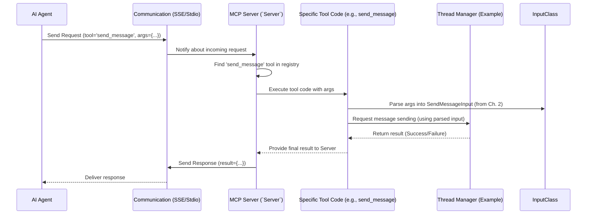

# Chapter 3: MCP Server (`Server`)

In the previous chapters, we learned about [Tools](01_tool__mcp_concept__.md) (the specific actions our server can perform) and [Tool Inputs (`*Input` classes)](02_tool_inputs____input__classes__.md) (the structured forms needed to request those actions).

Now, imagine you have all these fantastic tools ready in your workshop. You also have the blueprints (`*Input` classes) telling you exactly what materials each tool needs. But who actually runs the workshop? Who takes the orders (requests) from customers (clients), finds the right tool, makes sure the blueprint is followed, operates the tool, and gives the finished product back to the customer?

We need a manager, a central operator for our workshop. In the `coral-server` project, this role is played by the **MCP Server (`Server`)** object.

## What is the `Server`? The Workshop Manager

Think of the `Server` object, provided by the underlying MCP (Model Context Protocol) Kotlin SDK, as the **main switchboard operator** or the **workshop manager** for your entire `coral-server` application.

It's the central piece that brings everything together and makes it work. Its main jobs are:

1.  **Handling Communication:** It knows how to "talk" to clients using specific communication protocols. In `coral-server`, this could be:
    *   **Server-Sent Events (SSE):** A way for a server to continuously send updates to a web browser or application over a standard web connection (HTTP). Think of it like a live news feed.
    *   **Stdio (Standard Input/Output):** Simple text-based communication, often used when running programs from a command line or terminal. The server reads commands from the input and writes results to the output.
    The `Server` doesn't handle the raw network details itself, but it works *with* specific "Transport" components (like `SseServerTransport` or `StdioServerTransport`) that manage the connection.

2.  **Managing the Lifecycle:** It controls the startup and shutdown of the server application. It gets things running and makes sure everything stops gracefully when needed.

3.  **Knowing Available Tools:** The `Server` holds a registry (a list) of all the [Tools](01_tool__mcp_concept__.md) that have been added to it, like `register_agent`, `send_message`, etc. It knows their names, descriptions, and input requirements.

4.  **Directing Traffic:** When a client sends a request (like "Use tool `send_message` with these inputs..."), the `Server` receives it via the communication channel. It looks at the requested tool name, finds the corresponding tool code in its registry, and triggers that code, passing along the [Tool Inputs](02_tool_inputs____input__classes__.md).

5.  **Enforcing the Rules:** It ensures that the communication between the client and the server follows the standard rules defined by the Model Context Protocol (MCP).

In short, the `Server` is the heart of the application, coordinating communication and actions.

## Creating and Configuring the Server

Setting up the `Server` involves creating an instance of it and then "teaching" it which tools it should manage. This typically happens in the main setup part of the application, which we'll explore fully in [Server Configuration & Entry Point (`Main.kt`)](07_server_configuration___entry_point___main_kt___.md).

Here's a simplified look at how the server might be configured (inspired by `Main.kt`):

```kotlin
// Simplified from Main.kt

// Function to set up the server
fun configureServer(): Server {
    // 1. Create the Server instance
    val server = Server(
        // Tell it about our application's name and version
        Implementation(
            name = "mcp-kotlin test server",
            version = "0.1.0"
        ),
        // Optional settings (details not crucial now)
        ServerOptions(...)
    )

    // 2. Add all the tools the server should know about
    // This function (defined elsewhere) adds tools like
    // register_agent, send_message, etc.
    server.addThreadTools()

    // 3. Return the configured server object
    return server
}
```

Let's break this down:

1.  `val server = Server(...)`: We create the `Server` object. We pass some basic information like the application's `name` and `version`. Other `ServerOptions` can fine-tune its behavior, but we don't need to worry about those details yet.
2.  `server.addThreadTools()`: This is a crucial step! This calls a helper function (defined in `ThreadToolsRegistry.kt`) that adds all the specific [Tools](01_tool__mcp_concept__.md) (like `register_agent`, `send_message`, etc.) to the `server`'s internal registry. Think of this as stocking the workshop with all the necessary equipment.
3.  `return server`: The function returns the fully configured `Server` object, ready to be connected to a communication channel (like SSE or Stdio) and start listening for requests.

This setup function essentially prepares our "switchboard operator" by giving it an identity and telling it which extensions (tools) are available.

## How it Works: Handling a Request

Let's trace what happens when a client (like an AI agent) wants to use a tool, using our switchboard analogy:

1.  **Incoming Call:** The client sends a message over the established communication channel (e.g., SSE or Stdio). This message says, "I want to use the tool named `send_message`," and includes the necessary information (the [Tool Inputs](02_tool_inputs____input__classes__.md), like `threadId`, `senderId`, `content`).
2.  **Operator Receives Call:** The `Server` object (working with its Transport helper) receives this incoming message.
3.  **Operator Checks Directory:** The `Server` looks at the requested tool name (`send_message`). It checks its internal registry (the list of tools added via `addThreadTools()`) to find the tool with that name.
4.  **Operator Connects Call:** If the tool is found, the `Server` activates the specific code block associated with the `send_message` tool. It passes the input arguments provided by the client to this code block.
5.  **Action Performed:** The `send_message` tool's code runs. It might use the [Thread Manager (`ThreadManager`)](05_thread_manager___threadmanager__.md) to actually process the message sending.
6.  **Result Relayed:** The tool's code finishes and produces a result (e.g., "Message sent successfully" or "Error: Thread not found").
7.  **Operator Reports Back:** The `Server` takes this result, packages it according to the MCP rules, and sends it back to the original client over the same communication channel.

Here's a simplified diagram of this flow:



The `Server` acts as the central orchestrator, ensuring requests are properly received, routed to the correct tool, and the results are sent back. It connects the communication layer (Transport) with the action layer (Tools).

## Conclusion

You've now met the **MCP Server (`Server`)** – the central coordinator of our `coral-server` application. It's the component responsible for managing communication protocols (like SSE or Stdio), holding the registry of available [Tools](01_tool__mcp_concept__.md), and directing incoming requests to the correct tool logic using the provided [Tool Inputs](02_tool_inputs____input__classes__.md). Think of it as the indispensable switchboard operator keeping everything connected and running smoothly.

We saw how it's configured and how it processes a typical request. While the `Server` manages the tools and communication flow, the actual *state* of the application – things like who the agents are, what conversations (threads) exist, and the messages within them – is managed by other components.

In the next chapter, we'll look at the data structures used to represent these core concepts within the server.

**Next Chapter:** [Agent / Thread / Message Models](04_agent___thread___message_models_.md)

---
