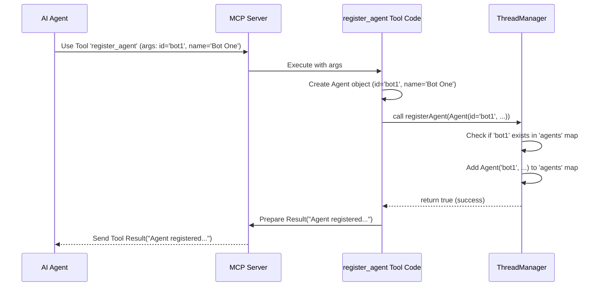

# Chapter 5: Thread Manager (`ThreadManager`)

Welcome back! In the [previous chapter](04_agent___thread___message_models_.md), we explored the blueprints for our core data: the `Agent`, `Thread`, and `Message` models. These models define *how* we structure information about users, conversations, and the messages they exchange.

But just having blueprints isn't enough. If you have blueprints for a house, you still need someone to *manage* the construction, keep track of the materials, know which room is which, and store the keys. Similarly, our server needs a central component to *manage* all the actual agents, threads, and messages based on those blueprints.

This is where the **`ThreadManager`** comes in!

## What is the `ThreadManager`? The Central Hub

Imagine you're a meticulous event planner managing a large conference with many different sessions (conversations) happening simultaneously. Your job is to:

1.  Keep a list of all attendees (`Agent`s).
2.  Know which sessions (`Thread`s) are running.
3.  Know who is invited to each session (`participants` in a `Thread`).
4.  Store all the notes and messages exchanged during each session (`Message`s in a `Thread`).
5.  Enforce rules, like who can enter a session or when a session is officially over.

The `ThreadManager` in `coral-server` plays exactly this role for our chat system. It's the **central hub** that manages the application's state – specifically, all the active agents, ongoing threads, and messages.

Think of it as:

*   **An In-Memory Database:** It holds all the current information about agents, threads, and messages directly in the computer's memory while the server is running. It uses the [Agent / Thread / Message Models](04_agent___thread___message_models_.md) as the structure for this data.
*   **A Rule Engine:** It contains the logic for actions like adding a participant (checking if the thread exists and isn't closed), sending a message (checking if the sender is a participant), or registering an agent (checking if the ID is already taken).

Almost every [Tool (MCP Concept)](01_tool__mcp_concept__.md) that modifies or queries the chat state interacts with the `ThreadManager`. When an agent uses the `register_agent` tool, the tool's code calls the `ThreadManager` to actually store the new agent's details. When an agent uses `send_message`, that tool calls the `ThreadManager` to add the message to the correct thread.

## How it Works: The Singleton Manager

In the `coral-server` code (specifically in `ThreadModels.kt`), the `ThreadManager` is defined as a special kind of structure called a `singleton object`. This means there is **only ever one instance** of the `ThreadManager` running in the entire application. Everyone shares this single instance.

```kotlin
// Simplified from: src/main/kotlin/org/coralprotocol/agentfuzzyp2ptools/ThreadModels.kt

// The keyword 'object' makes this a singleton
object ThreadManager {

    // Internal storage for agents (like an address book)
    // Key: Agent ID (String), Value: Agent object
    private val agents = ConcurrentHashMap<String, Agent>()

    // Internal storage for threads (like folders for conversations)
    // Key: Thread ID (String), Value: Thread object
    private val threads = ConcurrentHashMap<String, Thread>()

    // ... other storage and helper functions ...

    // Function to register a new agent
    fun registerAgent(agent: Agent): Boolean {
        // Check if agent ID already exists
        if (agents.containsKey(agent.id)) {
            return false // Registration failed
        }
        // Add the new agent to our 'agents' map
        agents[agent.id] = agent
        return true // Registration succeeded
    }

    // Function to get agent details by ID
    fun getAgent(agentId: String): Agent? {
        // Look up the agent in the 'agents' map
        return agents[agentId]
    }

    // Function to create a new thread
    fun createThread(name: String, creatorId: String, participantIds: List<String>): Thread? {
        // 1. Check if the creator agent exists
        // 2. Check if participant agents exist
        // 3. Create a new Thread object (using the Thread model)
        // 4. Store the new thread in the 'threads' map
        // 5. Return the created thread
        // ... (Implementation details omitted for brevity) ...
        return null // Placeholder
    }

    // Function to send a message
    fun sendMessage(threadId: String, senderId: String, content: String, mentions: List<String>): Message? {
        // 1. Find the thread by threadId in the 'threads' map
        // 2. Check if the sender is a participant in that thread
        // 3. Check if the thread is not closed
        // 4. Create a new Message object (using the Message model)
        // 5. Add the new message to the thread's internal list of messages
        // 6. Return the created message
        // ... (Implementation details omitted for brevity) ...
        return null // Placeholder
    }

    // ... many other functions like addParticipant, closeThread, etc. ...
}
```

Let's break this down:

1.  `object ThreadManager`: This declares the single instance named `ThreadManager`.
2.  `private val agents = ConcurrentHashMap<String, Agent>()`: This creates a private (internal) map to store `Agent` objects. The `ConcurrentHashMap` is a special type of map that's safe to use even when multiple tools might try to access or modify it at the same time (it handles concurrency). The key is the agent's unique `String` ID, and the value is the `Agent` object itself.
3.  `private val threads = ConcurrentHashMap<String, Thread>()`: Similarly, this map stores the `Thread` objects, keyed by their unique `String` ID.
4.  `fun registerAgent(...)`: This is a function provided by the `ThreadManager`. Tools like `register_agent` will call this function. It takes an `Agent` object as input, checks if the ID is unique, and if so, adds it to the `agents` map.
5.  `fun sendMessage(...)`: Another function provided by the `ThreadManager`. The `send_message` tool calls this. It performs checks (does the thread exist? is the sender allowed? is the thread closed?), creates a `Message` object using the blueprint from the [Agent / Thread / Message Models](04_agent___thread___message_models_.md), and adds it to the correct `Thread`'s internal message list (which is stored within the `Thread` object in the `threads` map).

The `ThreadManager` acts as the gatekeeper and organizer for all the chat state data.

## Example Flow: Registering an Agent

Let's revisit how registering an agent works, now including the `ThreadManager`:

1.  **Client Request:** An AI agent sends a request to the [MCP Server (`Server`)](03_mcp_server___server___.md) using the `register_agent` [Tool (MCP Concept)](01_tool__mcp_concept__.md) and providing the necessary `agentId` and `agentName` as defined in the `RegisterAgentInput` [Tool Inputs (`*Input` classes)](02_tool_inputs____input__classes__.md).
2.  **Server Routes:** The `Server` receives the request and finds the code associated with the `register_agent` tool.
3.  **Tool Executes:** The `register_agent` tool code runs. It parses the input arguments into a `RegisterAgentInput` object.
4.  **Tool Calls Manager:** The tool code then calls `ThreadManager.registerAgent(...)`, passing it a newly created `Agent` object (using the blueprint from [Agent / Thread / Message Models](04_agent___thread___message_models_.md)) containing the ID and name.
5.  **Manager Stores Data:** The `ThreadManager.registerAgent` function checks if the agent ID is already in its internal `agents` map. If not, it adds the new `Agent` object to the map.
6.  **Manager Replies to Tool:** The `ThreadManager` returns `true` (success) or `false` (failure) back to the tool code.
7.  **Tool Replies to Server:** The tool code creates a result message (e.g., "Agent registered successfully").
8.  **Server Replies to Client:** The `Server` sends the result back to the original client.

Here’s a diagram showing this interaction:



The `ThreadManager` is the crucial component that actually modifies the application's state (in this case, adding to the list of known agents).

## The Heart of the State

The `ThreadManager` is essentially the "single source of truth" for the current state of all conversations within the `coral-server`. Because it holds all the data in memory:

*   **It's Fast:** Accessing data stored in memory is much quicker than reading from a disk or a separate database.
*   **It's Volatile:** If the server restarts, all the information stored in the `ThreadManager` (agents, threads, messages) is lost because it only exists in memory. For persistent storage, you would typically need to add a database connection. `coral-server` primarily focuses on the real-time interaction aspects.

## Conclusion

You've now learned about the **`ThreadManager`**, the central hub and in-memory state manager for `coral-server`. It acts like an event planner or a librarian, keeping track of all registered `Agent`s, active `Thread`s, and exchanged `Message`s using the models we learned about previously.

We saw that it's a `singleton object`, meaning there's only one instance, and it provides functions (like `registerAgent`, `sendMessage`, `createThread`) that are called by the various [Tools](01_tool__mcp_concept__.md) to interact with and modify the application's state. It uses structures like `ConcurrentHashMap` internally to safely store data in memory.

The `ThreadManager` is vital because it holds the current "reality" of the chat system. But how does an agent *wait* for new messages intended for it, without constantly asking "Any new messages yet?"? That requires a more sophisticated mechanism built on top of the `ThreadManager`, which we'll explore next.

**Next Chapter:** [Asynchronous Message Waiting (`waitForMentions`)](06_asynchronous_message_waiting___waitformentions__.md)

---
