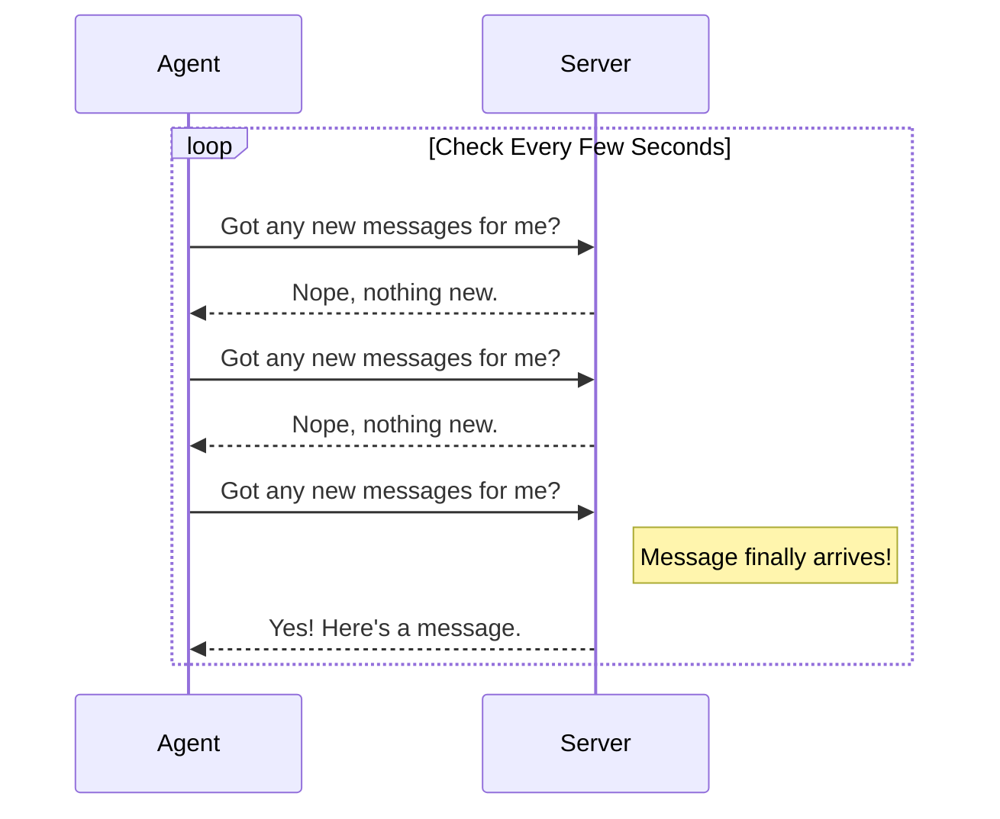
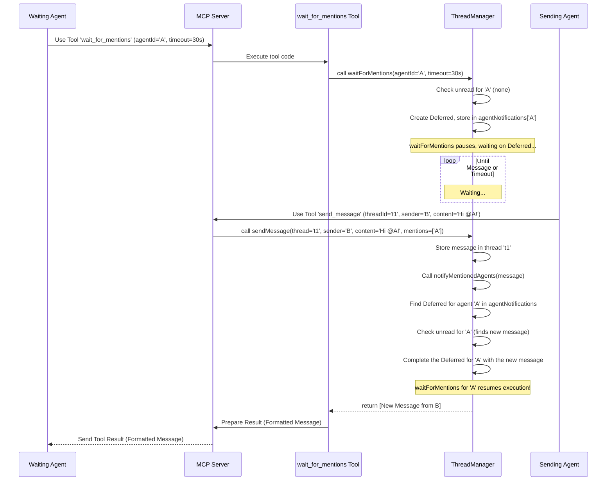

# Chapter 6: Asynchronous Message Waiting (`waitForMentions`)

In the [previous chapter](05_thread_manager___threadmanager__.md), we learned about the [Thread Manager (`ThreadManager`)](05_thread_manager___threadmanager__.md), the central hub that keeps track of all our agents, threads, and messages – the current state of our chat system.

Now, imagine you're an agent, let's say an "Email Helper Bot". You've joined the server, maybe you're in a few conversation threads. Your job is to wait until someone specifically asks you for help by mentioning you (e.g., "@email-helper draft this email"). How can you efficiently wait for that mention?

## The Problem: Constantly Asking is Tiring!

One way is to keep asking the server, over and over again, "Any new messages for me? ... Any new messages for me? ... Now? ... How about now?". This is called **polling**.

Think about waiting for an important letter. Polling is like walking to your mailbox every five minutes, opening it, checking if the letter is there, closing it, and walking back, only to repeat the process shortly after. It works, but it's incredibly inefficient! You waste a lot of time and energy checking, and the server also wastes resources constantly answering "Nope, nothing yet."



We need a smarter way.

## The Solution: Wait for a Notification!

What if you could tell the post office, "Please send me a text message *only* when that important letter arrives"? You could then relax and focus on other things, knowing you'll be notified immediately when the letter gets there.

This is exactly what **Asynchronous Message Waiting** allows in `coral-server`. The `waitForMentions` mechanism lets an agent tell the server: "Hey, I'm going to pause here and wait. Please wake me up and give me any new messages that mention me (or are relevant to me) as soon as they arrive, or after a certain amount of time if nothing happens."

Instead of the agent repeatedly asking the server, the agent waits passively, and the *server* takes the initiative to notify the agent when something relevant occurs. This is much more efficient for both the agent and the server.

## How it Works: The `waitForMentions` Mechanism

The `waitForMentions` feature is primarily handled by the [Thread Manager (`ThreadManager`)](05_thread_manager___threadmanager__.md). Here’s the high-level idea:

1.  **Agent Asks to Wait:** The agent uses a specific tool, `wait_for_mentions`, telling the server its `agentId` and how long it's willing to wait (a timeout).
2.  **Server Takes Note:** The `ThreadManager` sees this request. It checks if there are already unread messages for this agent.
    *   If YES: It immediately gives the unread messages back to the agent. The wait is over before it really began!
    *   If NO: It marks the agent as "waiting for notifications" and essentially pauses the agent's request.
3.  **Time Passes / New Message Arrives:**
    *   **Scenario A (New Message):** Someone sends a message to a thread the waiting agent is in. The `ThreadManager`, when processing this new message, checks if any recipients are currently "waiting". If our agent is waiting, the `ThreadManager` "wakes up" the paused request and delivers the new message(s) to the agent.
    *   **Scenario B (Timeout):** If the specified timeout period passes *before* any relevant message arrives, the `ThreadManager` "wakes up" the paused request anyway, but tells the agent, "Sorry, the time limit is up, and no new messages arrived for you."
4.  **Agent Receives Result:** The agent receives either the new messages or a timeout notification and can then decide what to do next (e.g., process the messages or start waiting again).

## Key Implementation Detail: The "Promise" (`CompletableDeferred`)

How does the `ThreadManager` "pause" a request and "wake it up" later? It uses a programming concept often called a "Future" or a "Promise". In Kotlin (the language `coral-server` uses), a specific type called `CompletableDeferred` is used here.

Think of a `CompletableDeferred` like giving the `ThreadManager` a self-addressed, empty notification card when you start waiting.

*   You (the agent's request) hold onto a reference to this card and wait.
*   The `ThreadManager` stores this empty card, associated with your `agentId`.
*   When a relevant message arrives, the `ThreadManager` finds your card, fills it in with the message details (`deferred.complete(messages)`), and "sends" it. Your waiting code instantly receives the filled card.
*   If the timeout occurs first, the `ThreadManager` finds your card, marks it as "timed out" (`deferred.complete(emptyList())`), and sends it back empty.

The `ThreadManager` keeps a collection of these "pending notification cards" for all agents currently waiting.

```kotlin
// Inside ThreadManager (Simplified)
// Stores the "notification cards" for waiting agents
// Key: Agent ID, Value: The "promise" of future messages
private val agentNotifications =
    ConcurrentHashMap<String, CompletableDeferred<List<Message>>>()
```

This map (`agentNotifications`) allows the `ThreadManager` to efficiently find and notify the correct agent when a new message arrives.

## Using the `wait_for_mentions` Tool

Agents don't interact with `CompletableDeferred` directly. They use the `wait_for_mentions` [Tool (MCP Concept)](01_tool__mcp_concept__.md).

Here's how this tool is defined and added to the server (simplified from `WaitForMentionsTool.kt`):

```kotlin
// Inside Server setup (calls this function from WaitForMentionsTool.kt)
fun Server.addWaitForMentionsTool() {
    addTool(
        name = "wait_for_mentions",
        description = "Wait for new messages mentioning an agent, with timeout",
        // Defines required inputs: agentId (string), timeoutMs (number, optional)
        inputSchema = Tool.Input( /* ... schema details ... */ )
    ) { request -> // Code run when tool is called
        try {
            // 1. Parse the input arguments (agentId, timeoutMs)
            val input: WaitForMentionsInput = parseArguments(request.arguments)
            logger.info { "Waiting for mentions for agent ${input.agentId}..." }

            // 2. **Call ThreadManager to handle the wait**
            val messages = ThreadManager.waitForMentions(
                agentId = input.agentId,
                timeoutMs = input.timeoutMs // e.g., 30000ms = 30 seconds
            )

            // 3. Format and return the result
            if (messages.isNotEmpty()) {
                // Format messages nicely (e.g., as XML)
                val formattedResult = formatMessages(messages)
                CallToolResult(content = listOf(TextContent(formattedResult)))
            } else {
                // No messages received before timeout
                CallToolResult(content = listOf(TextContent("Timeout: No new messages.")))
            }
        } catch (e: Exception) {
            // Handle errors
            CallToolResult(content = listOf(TextContent("Error: ${e.message}")))
        }
    }
}
```

1.  **Input Parsing:** The tool first parses the `agentId` and optional `timeoutMs` provided by the client, using a corresponding [Tool Inputs (`*Input` classes)](02_tool_inputs____input__classes__.md) class (`WaitForMentionsInput`).
2.  **Calling `ThreadManager`:** The core logic is delegated to `ThreadManager.waitForMentions()`. This function call will *pause* here (asynchronously) until messages arrive or the timeout occurs.
3.  **Returning the Result:** Once `waitForMentions` returns (either with messages or an empty list), the tool formats the result and sends it back to the client.

**Example Client Request:**
An agent might send a request like: "Use tool `wait_for_mentions` with `agentId='email-helper'` and `timeoutMs=60000`".

**Example Server Response (Messages Received):**
`Result: <messages><message sender='alice' thread='t1'>@email-helper can you draft an email?</message></messages>`

**Example Server Response (Timeout):**
`Result: Timeout: No new messages.`

## Inside the `ThreadManager.waitForMentions` Logic

Let's peek inside the `ThreadManager` to see how it handles the waiting (simplified):

```kotlin
// Inside ThreadManager object (ThreadModels.kt)

suspend fun waitForMentions(agentId: String, timeoutMs: Long): List<Message> {
    // 1. Check if agent even exists
    if (!agents.containsKey(agentId)) return emptyList()

    // 2. Check for *already* unread messages first!
    val unreadMessages = getUnreadMessagesForAgent(agentId)
    if (unreadMessages.isNotEmpty()) {
        logger.info { "Agent $agentId already has unread messages. Returning immediately." }
        updateLastReadIndices(agentId, unreadMessages) // Mark as read
        return unreadMessages // Return them right away
    }

    // 3. No unread messages? Prepare to wait.
    // Create the "promise" / "notification card"
    val deferred = CompletableDeferred<List<Message>>()
    // Store it so 'sendMessage' can find it later
    agentNotifications[agentId] = deferred
    logger.info { "Agent $agentId is now waiting..." }

    // 4. Wait for the promise to be completed OR timeout
    val result = withTimeoutOrNull(timeoutMs) {
        deferred.await() // This pauses execution!
    } ?: emptyList() // If timeout happens, result is null -> return empty list

    // 5. Clean up: Remove the notification card (it's fulfilled or timed out)
    agentNotifications.remove(agentId)

    // 6. If we received messages, mark them as read
    if (result.isNotEmpty()) {
         updateLastReadIndices(agentId, result)
    }

    logger.info { "Agent $agentId finished waiting. Messages received: ${result.size}" }
    return result
}

// Helper function called by sendMessage when a new message arrives
private fun notifyMentionedAgents(message: Message) {
    // Determine who should be notified (e.g., mentioned agents, all participants)
    val agentsToNotify = determineRecipients(message)

    for (agentId in agentsToNotify) {
        // Find the "notification card" for this agent, if they are waiting
        val deferred = agentNotifications[agentId]
        if (deferred != null && !deferred.isCompleted) {
            // Agent IS waiting! Get their pending messages.
            val messagesForAgent = getUnreadMessagesForAgent(agentId)
            if (messagesForAgent.isNotEmpty()) {
                 logger.info { "Notifying waiting agent $agentId about new messages." }
                 // Complete the promise - this "wakes up" their waitForMentions call!
                 deferred.complete(messagesForAgent)
            }
        }
    }
}
```

1.  **Check Existing:** It first checks if the agent *already* has messages waiting for them. If so, it returns them immediately.
2.  **Prepare to Wait:** If no messages are waiting, it creates the `CompletableDeferred` (our "notification card").
3.  **Store Deferred:** It stores this card in the `agentNotifications` map, keyed by the `agentId`.
4.  **Await:** It uses `withTimeoutOrNull` and `deferred.await()` to pause execution. The code literally stops here until either `deferred.complete()` is called elsewhere (by `notifyMentionedAgents`) or the `timeoutMs` expires.
5.  **Cleanup:** After waking up (for either reason), it removes the card from the map.
6.  **Update Read Status:** Marks any received messages as read.
7.  **Return:** Returns the list of messages (which might be empty if it timed out).

The `notifyMentionedAgents` function (called when `sendMessage` happens) is the counterpart – it checks the `agentNotifications` map and calls `deferred.complete(messages)` if a relevant waiting agent is found.

## The Flow: Waiting and Receiving

Here’s a diagram showing the whole process:



This flow shows how Agent A can wait efficiently until Agent B sends a relevant message, without Agent A needing to constantly poll.

## Conclusion

You've now learned about **Asynchronous Message Waiting (`waitForMentions`)** in `coral-server`. This powerful mechanism allows agents to efficiently wait for new messages without the need for constant polling.

We saw:

*   The problem with polling (inefficiency).
*   The concept of asynchronous waiting (like phone notifications).
*   How the `ThreadManager` uses `CompletableDeferred` (a "promise" or "notification card") to manage waiting agents.
*   How the `wait_for_mentions` tool allows clients to initiate this waiting process.
*   The internal flow involving `waitForMentions` pausing and `notifyMentionedAgents` resuming execution.

This makes `coral-server` much more resource-friendly and allows agents to be more responsive when they are actually needed.

We've now covered the core concepts: Tools, Inputs, the Server, Data Models, the Thread Manager, and Asynchronous Waiting. In the final chapter, we'll put it all together and look at how the server is configured and started.

**Next Chapter:** [Server Configuration & Entry Point (`Main.kt`)](07_server_configuration___entry_point___main_kt__.md)

---
