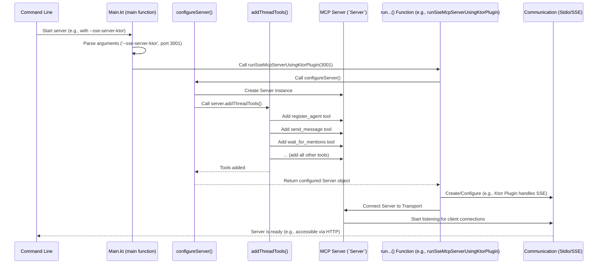

# Chapter 7: Server Configuration & Entry Point (`Main.kt`)

Welcome to the final chapter of our core `coral-server` tutorial! In the [previous chapter](06_asynchronous_message_waiting___waitformentions__.md), we explored the efficient `waitForMentions` mechanism that allows agents to wait for messages without constantly polling the server.

So far, we've learned about all the individual components:
*   [Tools (MCP Concept)](01_tool__mcp_concept__.md): The actions the server can perform.
*   [Tool Inputs (`*Input` classes)](02_tool_inputs____input__classes__.md): The forms needed for tool requests.
*   [MCP Server (`Server`)](03_mcp_server___server___.md): The central manager for tools and communication.
*   [Agent / Thread / Message Models](04_agent___thread___message_models_.md): The blueprints for our data.
*   [Thread Manager (`ThreadManager`)](05_thread_manager___threadmanager__.md): The hub that manages the server's state (agents, threads, messages).
*   [Asynchronous Message Waiting (`waitForMentions`)](06_asynchronous_message_waiting___waitformentions__.md): How agents wait for notifications.

Now, imagine you've designed all the different stations in a restaurant kitchen (the tools), defined the order slips (tool inputs), hired a head chef (the `Server` object), created menu item templates (the data models), and designated a manager to track orders and table status (the `ThreadManager`). How do you actually *open* the restaurant?

You need a plan for the grand opening! You need to decide:
*   Will it be take-out only, sit-down dining, or both? (Like choosing the communication method: Stdio, SSE).
*   Where do you unlock the front door and turn on the lights? (The application's starting point).
*   How do you ensure the kitchen is stocked and the staff knows what to do? (Configuring the server and adding tools).
*   How do you officially open the doors for customers? (Starting the server to listen for connections).

This is exactly what the **Server Configuration & Entry Point (`Main.kt`)** file does for `coral-server`. It's the **master script** that starts the whole application, wires all the pieces together, and tells the server *how* to run and listen for clients.

## The Starting Gun: The `main` Function

Like many programs, the `coral-server` application begins execution in a special function called `main`. This function is defined in the `Main.kt` file. It's the very first piece of code that runs when you start the server.

```kotlin
// Simplified from: src/main/kotlin/org/coralprotocol/agentfuzzyp2ptools/Main.kt
package org.coralprotocol.agentfuzzyp2ptools

// ... imports ...

fun main(args: Array<String>) {
    // 1. Decide HOW to run based on command-line input
    val command = args.firstOrNull() ?: "--sse-server-ktor" // Default if no input
    val port = args.getOrNull(1)?.toIntOrNull() ?: 3001     // Default port 3001

    // 2. Run the chosen server type
    when (command) {
        "--stdio" -> runMcpServerUsingStdio()
        "--sse-server-ktor" -> runSseMcpServerUsingKtorPlugin(port)
        "--sse-server" -> runSseMcpServerWithPlainConfiguration(port)
        else -> {
            logger.error { "Unknown command: $command" }
        }
    }
}
```

1.  **Command Decision:** It looks at the arguments (`args`) you provide when starting the server from your computer's command line. For example, you might run `java -jar coral-server.jar --stdio`. The `main` function checks the first argument (`--stdio` in this case). If you don't provide one, it defaults to `--sse-server-ktor`. It also checks for an optional port number, defaulting to 3001.
2.  **Running the Server:** Based on the `command`, it calls one of three different functions:
    *   `runMcpServerUsingStdio()`: Starts the server using simple text-based communication over standard input/output (like typing commands in a terminal).
    *   `runSseMcpServerUsingKtorPlugin(port)`: Starts the server using Server-Sent Events (SSE) for web-based communication, managed by the Ktor web framework plugin. This is often the easiest way to run the SSE version.
    *   `runSseMcpServerWithPlainConfiguration(port)`: Also starts an SSE server, but configures it more manually within Ktor.

The `main` function acts like the restaurant owner deciding whether to open for take-out (`--stdio`) or dine-in (`--sse-server-ktor`).

## Preparing the Kitchen: `configureServer()`

Regardless of *how* the server communicates (Stdio or SSE), the core setup is the same. We need to create the main [MCP Server (`Server`)](03_mcp_server___server___.md) instance and tell it about all the [Tools (MCP Concept)](01_tool__mcp_concept__.md) it can use. This happens in the `configureServer()` function, which is called by *all* the `run...` functions.

```kotlin
// Simplified from: src/main/kotlin/org/coralprotocol/agentfuzzyp2ptools/Main.kt

// This function sets up the core server logic
fun configureServer(): Server {
    // 1. Create the main Server object
    val server = Server(
        Implementation( // Basic info about our app
            name = "mcp-kotlin test server",
            version = "0.1.0"
        ),
        // Optional server capabilities (details not vital now)
        ServerOptions(...)
    )

    // 2. **Add all the tools!**
    // This extension function (from ThreadToolsRegistry.kt)
    // registers register_agent, send_message, wait_for_mentions, etc.
    server.addThreadTools()

    // 3. Return the ready-to-go server instance
    return server
}
```

1.  **Create `Server`:** It creates the central `Server` object, giving it a name and version. Think of this as hiring the head chef.
2.  **Add Tools:** It calls `server.addThreadTools()`. This is a crucial helper function (defined in `ThreadToolsRegistry.kt`) that adds *all* the tools we've discussed (like `register_agent`, `send_message`, `create_thread`, `wait_for_mentions`, etc.) to the `server` instance. This is like stocking the kitchen with all the equipment (tools) the chef needs.
3.  **Return:** It returns the configured `Server` object, ready to be connected to a communication channel.

## Opening for Business: The `run...()` Functions

Once the `Server` is configured by `configureServer()`, the specific `run...()` function chosen by `main` takes over to connect it to the outside world and start listening.

### Take-Out Only: `runMcpServerUsingStdio()`

This function sets up the server to communicate via simple text input and output.

```kotlin
// Simplified from: src/main/kotlin/org/coralprotocol/agentfuzzyp2ptools/Main.kt

fun runMcpServerUsingStdio() {
    // 1. Configure the core server logic
    val server = configureServer()

    // 2. Create the Stdio communication channel
    val transport = StdioServerTransport(
        inputStream = System.`in`.asSource().buffered(), // Read from keyboard
        outputStream = System.out.asSink().buffered()  // Write to screen
    )

    // 3. Connect the server to the channel and start listening
    runBlocking { // Start a coroutine context
        server.connect(transport)
        logger.info { "Stdio server running. Type MCP commands." }
        // Keep the server running until stopped
        Job().join() // Wait indefinitely
    }
}
```

1.  It gets the configured `server` instance.
2.  It creates a `StdioServerTransport`, telling it to read from standard input (usually the keyboard) and write to standard output (usually the screen). This is the "take-out window".
3.  It calls `server.connect(transport)`. This links the `Server` object to the `StdioServerTransport` and tells it to start processing commands received through that transport. The `Job().join()` keeps the server alive.

### Dine-In (Easy Setup): `runSseMcpServerUsingKtorPlugin()`

This uses the Ktor web framework and a special `mcp` plugin to handle SSE communication almost automatically.

```kotlin
// Simplified from: src/main/kotlin/org/coralprotocol/agentfuzzyp2ptools/Main.kt

fun runSseMcpServerUsingKtorPlugin(port: Int): Unit = runBlocking {
    logger.info { "Starting SSE server (Ktor Plugin) on port $port" }

    // 1. Start the Ktor web server
    embeddedServer(CIO, host = "0.0.0.0", port = port) {
        // 2. Use the MCP plugin - magic happens here!
        mcp {
            // 3. Tell the plugin how to configure the server
            configureServer() // Our setup function is passed here
        }
    }.start(wait = true) // 4. Launch the web server and wait
}
```

1.  It starts an `embeddedServer` using Ktor.
2.  It installs the `mcp` plugin. This plugin knows how to handle SSE connections for MCP.
3.  Inside the plugin's configuration block, it calls *our* `configureServer()` function. The plugin uses the `Server` object returned by `configureServer()` to manage the MCP logic. The plugin automatically creates the necessary `SseServerTransport` and connects it to our `Server`.
4.  `start(wait = true)` launches the web server, making it accessible at `http://localhost:<port>/sse`.

This is like having a full-service restaurant where the manager (the Ktor plugin) handles taking orders and serving tables automatically based on the head chef's (our `Server` object's) capabilities.

### Dine-In (Manual Setup): `runSseMcpServerWithPlainConfiguration()`

This also uses Ktor for SSE but sets up the communication routes more explicitly. It gives more control but requires a bit more code.

```kotlin
// Simplified from: src/main/kotlin/org/coralprotocol/agentfuzzyp2ptools/Main.kt

fun runSseMcpServerWithPlainConfiguration(port: Int): Unit = runBlocking {
    val servers = ConcurrentMap<String, Server>() // Track servers per connection
    logger.info { "Starting SSE server (Plain) on port $port" }

    embeddedServer(CIO, host = "0.0.0.0", port = port) {
        install(SSE) // Enable Ktor's SSE feature
        routing {
            // 1. Define the main SSE connection endpoint
            sse("/sse") { // When a client connects to /sse...
                // 2. Create the SSE communication channel
                val transport = SseServerTransport("/message", this)
                // 3. Configure a NEW server instance for this connection
                val server = configureServer()
                servers[transport.sessionId] = server // Store it

                // 4. Connect the server to the channel
                server.connect(transport)
            }
            // 5. Define endpoint for receiving messages back from client
            post("/message") {
                // ... code to find the right transport/server
                // and handle incoming messages ...
            }
        }
    }.start(wait = true)
}
```

1.  It defines a route `/sse` where clients can establish an SSE connection.
2.  When a client connects, it creates an `SseServerTransport`.
3.  It calls `configureServer()` to get a fresh `Server` instance *for this specific connection*.
4.  It connects this `server` to the `transport`.
5.  It sets up another route (`/message`) for clients to send data back to the server over regular HTTP POST requests (since standard SSE is primarily server-to-client).

This is like setting up the tables, waiter stations, and kitchen communication system yourself before opening the restaurant.

## The Grand Opening Plan

Here's a simplified flow of how `Main.kt` starts the application:



1.  You run the application from the command line, possibly with arguments.
2.  The `main` function parses these arguments and decides which `run...()` function to call.
3.  The chosen `run...()` function calls `configureServer()`.
4.  `configureServer()` creates the `Server` instance and calls `addThreadTools()` to register all the tools.
5.  The `run...()` function then creates the appropriate communication `Transport` (or uses a plugin that does).
6.  It connects the configured `Server` to the `Transport`.
7.  The server starts listening for incoming client connections and requests.

## Conclusion

You've reached the end of the core `coral-server` tutorial! In this final chapter, we saw how the **`Main.kt`** file acts as the application's entry point and configuration hub.

*   The `main` function is the starting point, interpreting command-line arguments to decide *how* the server should run (Stdio, Ktor SSE Plugin, plain SSE).
*   The `configureServer()` function is the central place where the [MCP Server (`Server`)](03_mcp_server___server___.md) instance is created and all the [Tools (MCP Concept)](01_tool__mcp_concept__.md) are registered via `addThreadTools()`.
*   Specific `run...()` functions handle connecting the configured `Server` to the chosen communication transport (like `StdioServerTransport` or `SseServerTransport`) and starting the listening process.

`Main.kt` brings together all the concepts we've learned – Tools, Inputs, the Server object, Models, the Thread Manager, and Asynchronous Waiting – into a runnable application. It's the blueprint for the "grand opening," ensuring everything is set up correctly before the server opens its doors to clients.

Congratulations on completing this journey through the fundamental concepts of `coral-server`! You now have a solid understanding of how the different pieces fit together to enable communication and collaboration between agents.

---
