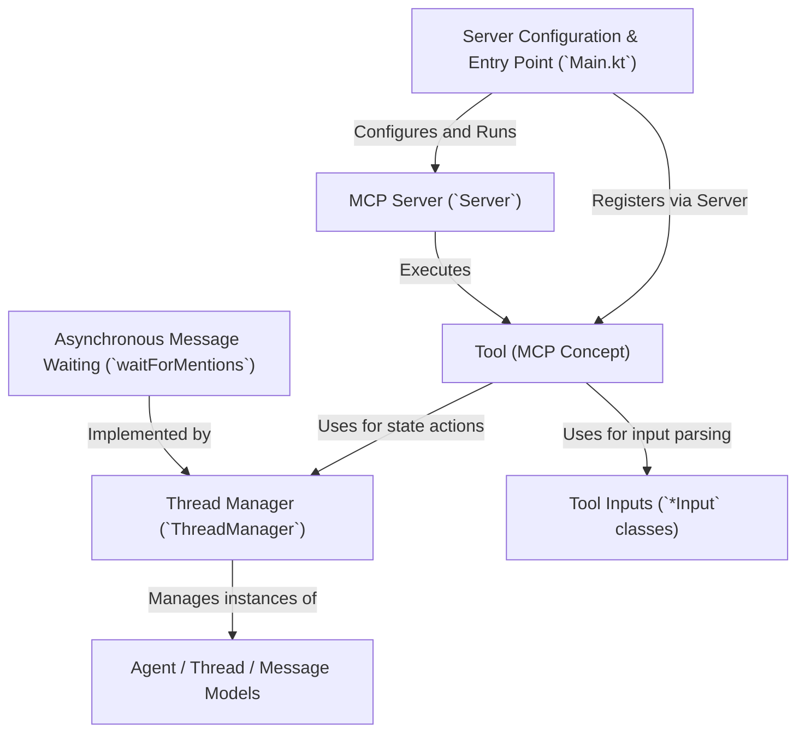

# Tutorial: coral-server

This project provides a **server** that follows the *Model Context Protocol (MCP)*.
It allows different *agents* (like AI assistants or users) to communicate within shared conversation *threads*.
The server offers specific actions called **Tools** (like sending messages, registering agents, or waiting for messages) and manages all the *agents*, *threads*, and *messages* exchanged between them using a central **Thread Manager**.

**Source Repository:** [https://github.com/Coral-Protocol/coral-server](https://github.com/Coral-Protocol/coral-server)

## Chapters

1. [Tool (MCP Concept)
](01_tool__mcp_concept__.md)
2. [Tool Inputs (`*Input` classes)
](02_tool_inputs____input__classes__.md)
3. [MCP Server (`Server`)
](03_mcp_server___server___.md)
4. [Agent / Thread / Message Models
](04_agent___thread___message_models_.md)
5. [Thread Manager (`ThreadManager`)
](05_thread_manager___threadmanager___.md)
6. [Asynchronous Message Waiting (`waitForMentions`)
](06_asynchronous_message_waiting___waitformentions___.md)
7. [Server Configuration & Entry Point (`Main.kt`)
](07_server_configuration___entry_point___main_kt___.md)

---