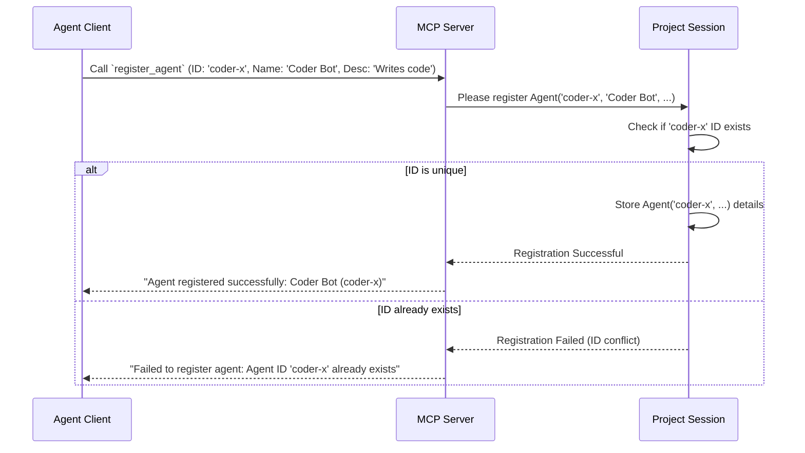

# Chapter 1: Agent

Welcome to the `sessions` tutorial! We're excited to help you understand how different AI components can work together.

Imagine you're building a team of AI assistants to collaborate on a task, like writing a report or analyzing data. How does each AI introduce itself? How does it join the "project room" where the work happens? That's where the concept of an **Agent** comes in.

## What is an Agent?

Think of an **Agent** as an individual team member in your AI project. It's a specific AI entity that can connect to the system, communicate, and perform tasks. Just like a human team member has a name and maybe a role, an Agent has key properties to identify it:

1.  **ID (`agentId`)**: A unique identifier, like an employee ID. This *must* be unique across all agents in the system. It's often best to make it descriptive, like `report-writer-alpha` or `data-analyzer-bot`. Avoid generic names like `agent` or `assistant`.
2.  **Name (`agentName`)**: A human-friendly name, like "Report Writer" or "Data Bot". This is how the agent might be referred to in conversations.
3.  **Description (optional)**: A brief explanation of what the agent does or is responsible for, like "Generates weekly sales summaries" or "Analyzes customer feedback sentiment".

In the `sessions` project, an Agent is represented by a simple data structure. Here's how it looks in the code (don't worry too much about the syntax yet!):

```kotlin
// From: src/main/kotlin/org/coralprotocol/coralserver/models/ThreadModels.kt

@Serializable // Makes this data structure sendable over the network
data class Agent(
    val id: String,         // The unique ID
    val name: String,       // The friendly name
    val description: String = "" // Optional description
)
```

This code defines a blueprint for creating Agent objects. Each Agent will have an `id`, a `name`, and an optional `description`.

## Joining the Team: Registering an Agent

Before an Agent can start collaborating, it needs to "sign in" or register itself with the system. This makes it known to the central coordinator (which we'll learn about later as the [Session Manager](03_session_manager_.md) and [MCP Server](07_mcp_server_.md)) and other potential collaborators.

Think of it like joining a company's employee directory. You provide your ID, name, and role so others know you exist and how to contact you.

Agents register themselves using a specific action or command, often called a [Tool](06_tool_.md). In `sessions`, there's a tool named `register_agent`. To use this tool, the Agent needs to provide its details.

Here's the kind of information the `register_agent` tool expects:

```kotlin
// From: src/main/kotlin/org/coralprotocol/coralserver/ThreadInputs.kt

@Serializable // Makes this data structure sendable
data class RegisterAgentInput(
    val agentId: String,        // The unique ID for the agent
    val agentName: String,      // The display name
    val description: String = "" // Optional role description
)
```

So, if an AI assistant designed to write code wants to join, it might send a registration request like this:

*   `agentId`: `code-generator-v1`
*   `agentName`: `Code Generator`
*   `description`: `Generates Python code snippets based on requests.`

**What happens when an Agent registers?**

When the `register_agent` tool is called with the Agent's details, the system does the following:

1.  Receives the registration request.
2.  Checks if an Agent with the same `agentId` already exists. If so, registration fails (IDs must be unique!).
3.  If the ID is unique, it stores the new Agent's information (ID, name, description).
4.  Sends back a confirmation message, like "Agent registered successfully: Code Generator (code-generator-v1)".

Now, the `code-generator-v1` Agent is officially part of the system and can be discovered by other Agents.

## Under the Hood: How Registration Works

Let's peek behind the curtain. When an Agent sends its registration details, what's happening inside the `sessions` system?

1.  **The Request Arrives:** The Agent (let's call it the "Client") sends the `register_agent` request, containing the ID, name, and description, to the main server (the [MCP Server](07_mcp_server_.md)).
2.  **Server Finds the Context:** The server figures out which specific "project room" or [Session](02_session_.md) this Agent belongs to. Sessions keep track of agents and conversations for a particular task or application context.
3.  **Session Stores the Agent:** The server tells the relevant [Session](02_session_.md) object to register the new Agent. The Session checks if the ID is unique within its context and, if so, adds the Agent's details to its internal list of registered agents.
4.  **Confirmation:** The Session tells the server registration was successful (or not). The server then sends a confirmation message back to the Agent Client.

Here's a simplified diagram showing the flow:



Now let's look at a tiny snippet of the code inside the `Session` that handles adding the agent:

```kotlin
// Simplified from: src/main/kotlin/org/coralprotocol/coralserver/session/Session.kt

// Stores agents: maps unique ID (String) to Agent object
private val agents = ConcurrentHashMap<String, Agent>()

// Register a new agent
fun registerAgent(agent: Agent): Boolean {
    // Check if an agent with this ID is already stored
    if (agents.containsKey(agent.id)) {
        // Already exists, cannot register again. Return failure (false).
        return false
    }
    // ID is unique! Store the new agent using its ID as the key.
    agents[agent.id] = agent
    // Return success (true).
    return true
}
```

This `registerAgent` function is the core part within the [Session](02_session_.md) that saves the Agent's details. It uses a simple map (`agents`) to keep track of everyone who has registered.

The `register_agent` [Tool](06_tool_.md) itself coordinates receiving the request, parsing the input details, creating the `Agent` object, and calling this `session.registerAgent` function.

```kotlin
// Simplified concept from: src/main/kotlin/org/coralprotocol/coralserver/tools/RegisterAgentTool.kt

// Inside the `register_agent` tool logic...
tool("register_agent") { request -> // When the tool is called
    // 1. Get agent details (id, name, desc) from the request
    val input = parseAgentDetails(request.arguments)

    // 2. Create the Agent object
    val agent = Agent(id = input.agentId, name = input.agentName, description = input.description)

    // 3. Find the correct Session for this request
    val session = findMySession()

    // 4. Try registering the agent within that session
    val success = session.registerAgent(agent)

    // 5. Send back a success or failure message
    if (success) {
        return successMessage("Agent registered: ${agent.name} (${agent.id})")
    } else {
        return failureMessage("Agent ID ${agent.id} already exists")
    }
}
```

## Conclusion

You've learned about the fundamental building block of collaboration in `sessions`: the **Agent**.

*   An **Agent** is an individual AI participant with a unique **ID**, a **name**, and an optional **description**.
*   Agents must **register** themselves using the `register_agent` tool before they can participate.
*   Registration involves providing the Agent's details to the system, which stores them within a specific context or **Session**.

Think of Agents as the essential first step – identifying the players before the game can begin!

Now that we know how individual AI members identify themselves, let's explore the "project room" where they gather. In the next chapter, we'll dive into the concept of a [Session](02_session_.md).

Next: [Chapter 2: Session](02_session_.md)

---
