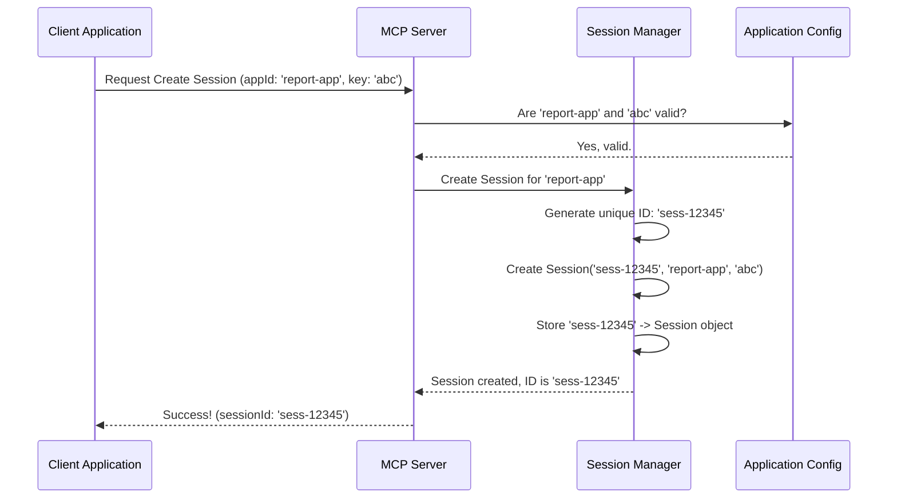

# Chapter 2: Session

In the [previous chapter](01_agent_.md), we learned about **[Agent](01_agent_.md)s** – the individual AI members of our collaborative team. We saw how they introduce themselves using a unique ID, name, and description, and how they `register` to become known to the system.

But where do these registered agents gather? If you have multiple projects or different groups of AI agents working on separate tasks, how do you keep their conversations and work organized and private? Imagine having several project teams working in the same big open office – it would be chaos!

This is where the concept of a **Session** comes in.

## What is a Session?

Think of a **Session** as a **private, dedicated project room** or a **workspace** for a specific group of [Agent](01_agent_.md)s working together on a particular task or application instance.

*   **Isolation:** It creates a boundary. Everything that happens within one Session (who's involved, what they talk about) is kept separate from all other Sessions. Just like closing the door to your project room keeps your team's discussion private from others in the hallway.
*   **Context:** It holds all the important information for that specific project or task:
    *   Which [Agent](01_agent_.md)s are registered and part of *this* team?
    *   What conversations ([Thread](04_thread_.md)s) are happening within *this* team?
    *   What [Message](05_message_.md)s have been exchanged *in those conversations*?

So, if you have one group of agents writing a report and another group analyzing customer data, each group would operate within its own separate Session.

## Creating a Session: Opening the Project Room

A Session doesn't just magically appear. It needs to be created, usually when an application first starts up or needs a new isolated workspace. Think of this as reserving and setting up a new project room.

To create a Session, you typically need:

1.  **Application ID (`applicationId`)**: Identifies the specific application requesting the session (e.g., `report-generator-app`).
2.  **Privacy Key (`privacyKey`)**: A secret key associated with the application, like a password, to ensure only authorized applications can create sessions for themselves.

The system (specifically, something we'll call the [Session Manager](03_session_manager_.md)) takes this information, verifies it, and if everything checks out, it creates a new Session. This new Session gets its own unique identifier:

3.  **Session ID (`sessionId`)**: A unique ID for *this specific Session*, like the room number for your project room (e.g., `sess-a8b3c1d9-e4f5`).

When a session is successfully created, the system usually replies with its details, including the newly generated `sessionId`.

Here's what the information confirming a new Session looks like in the code:

```kotlin
// From: src/main/kotlin/org/coralprotocol/coralserver/models/SessionModels.kt

@Serializable // Makes this data structure sendable
data class CreateSessionResponse(
    val sessionId: String,      // The unique ID for this specific session
    val applicationId: String,  // Which application this session belongs to
    val privacyKey: String      // The key used to create it (often returned for confirmation)
)
```

This `CreateSessionResponse` tells the application, "Okay, your private project room is ready! Its unique ID is `sessionId`." The application then uses this `sessionId` for all future interactions related to this specific workspace.

## What's Inside a Session?

Once created, the Session acts as a container. Let's peek inside our virtual project room:

*   **List of Registered Agents:** Remember how [Agent](01_agent_.md)s register? They register *within* a specific Session. The Session keeps a list of all the agents who have joined *this particular room*.
*   **Conversation Threads:** Agents communicate in [Thread](04_thread_.md)s. A Session holds all the different conversation threads happening within it. Think of these as different meeting notes or documents within the project room.
*   **Messages:** Every [Message](05_message_.md) sent between agents in a [Thread](04_thread_.md) is stored within that thread, which itself is stored within the Session.

The Session object in the code is responsible for managing all this information. Here's a highly simplified look at the `Session` class definition:

```kotlin
// Simplified from: src/main/kotlin/org/coralprotocol/coralserver/session/Session.kt

import org.coralprotocol.coralserver.models.Agent // We need the Agent definition
import java.util.concurrent.ConcurrentHashMap // A way to store things safely

class Session(
    val id: String,             // Unique Session ID (e.g., "sess-a8b3...")
    val applicationId: String,  // ID of the app owning this session
    val privacyKey: String      // The key used to create it
    // ... other properties like servers, threads, messages ...
) {
    // Stores agents registered *in this session*: maps unique Agent ID to Agent object
    private val agents = ConcurrentHashMap<String, Agent>()

    // Function to add an agent (from Chapter 1) to *this* session's list
    fun registerAgent(agent: Agent): Boolean {
        if (agents.containsKey(agent.id)) {
            return false // Already registered in this session!
        }
        agents[agent.id] = agent // Add the agent to our list
        // ... logic to notify about agent count changes ...
        return true
    }

    // Function to get a specific agent registered *in this session*
    fun getAgent(agentId: String): Agent? {
        return agents[agentId]
    }

    // Function to get ALL agents registered *in this session*
    fun getAllAgents(): List<Agent> {
        return agents.values.toList()
    }

    // ... functions for managing threads and messages within this session ...
}
```

Notice how the `Session` class has its own `id`, `applicationId`, and `privacyKey`. Crucially, it contains an internal list (`agents`) to keep track of the [Agent](01_agent_.md)s that have registered *specifically within this session*. The `registerAgent` function we touched upon in Chapter 1 actually belongs to the `Session` object – it adds the agent to *this specific project room's* member list.

## Under the Hood: How Sessions are Managed

Creating and keeping track of all these different project rooms requires a coordinator. This is the job of the [Session Manager](03_session_manager_.md).

1.  **Request:** An application sends a request to the main server ([MCP Server](07_mcp_server_.md)) asking to create a new Session, providing its `applicationId` and `privacyKey`.
2.  **Validation:** The server checks if the provided `applicationId` and `privacyKey` are valid (usually by comparing them against a configuration file).
3.  **Creation:** If valid, the server asks the [Session Manager](03_session_manager_.md) to create a new Session.
4.  **Storage:** The [Session Manager](03_session_manager_.md) generates a unique `sessionId`, creates the `Session` object, and stores it in its own list of active sessions, associating the new `sessionId` with the `Session` object.
5.  **Response:** The server sends the `CreateSessionResponse` (containing the new `sessionId`) back to the application.

Here's a diagram showing this flow:



The [Session Manager](03_session_manager_.md) acts like a receptionist or building manager, keeping a directory of all the project rooms (`Session`s) and handling requests to create new ones. Here's a simplified look at how the [Session Manager](03_session_manager_.md) might create and store a session:

```kotlin
// Simplified from: src/main/kotlin/org/coralprotocol/coralserver/session/SessionManager.kt

import java.util.concurrent.ConcurrentHashMap // Safe storage

object SessionManager {
    // Stores all active sessions: maps unique Session ID to Session object
    private val sessions = ConcurrentHashMap<String, Session>()

    // Creates a new session with a random ID
    fun createSession(applicationId: String, privacyKey: String): Session {
        val sessionId = java.util.UUID.randomUUID().toString() // Generate unique ID
        val session = Session(sessionId, applicationId, privacyKey) // Create the object
        sessions[sessionId] = session // Store it in our map
        return session
    }

    // Gets an existing session by its ID
    fun getSession(sessionId: String): Session? {
        return sessions[sessionId] // Look it up in our map
    }

    // ... other functions like getOrCreateSession ...
}
```

The `SessionManager` keeps a central map (`sessions`) where it stores every active `Session` object, keyed by its unique `sessionId`. When an [Agent](01_agent_.md) registers or sends a message later, the system uses the `sessionId` associated with that agent's connection or request to find the correct `Session` object via the `SessionManager`.

## Conclusion

You've now learned about the **Session**, the crucial concept for organizing collaboration in `sessions`.

*   A **Session** is an **isolated workspace** or "project room" for a specific task or application instance.
*   It holds the registered **[Agent](01_agent_.md)s**, **[Thread](04_thread_.md)s**, and **[Message](05_message_.md)s** relevant only to that specific context.
*   Sessions are created by providing an `applicationId` and `privacyKey`, and each gets a unique `sessionId`.
*   The **[Session Manager](03_session_manager_.md)** is responsible for creating and keeping track of all active Sessions.

Think of Sessions as the fundamental way to keep different AI collaborations separate and organized. Without them, it would be impossible to manage multiple teams or tasks concurrently.

Now that we understand individual [Agent](01_agent_.md)s and the isolated [Session](02_session_.md)s they operate within, how does the system manage all these different Sessions? Let's dive into the role of the manager itself.

Next: [Chapter 3: Session Manager](03_session_manager_.md)

---
