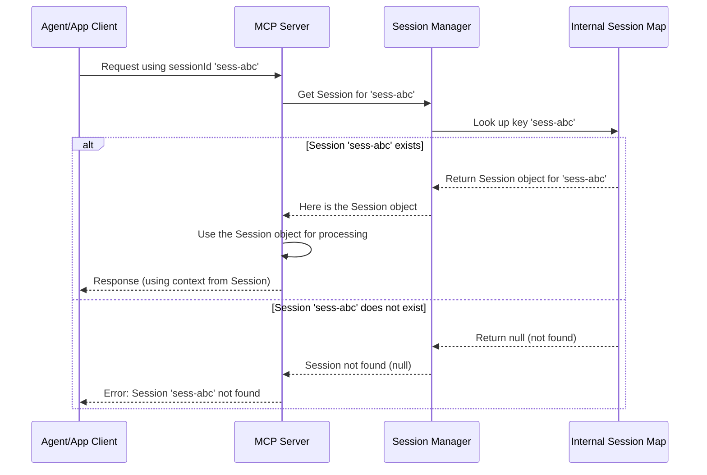

# Chapter 3: Session Manager

In the [previous chapter](02_session_.md), we explored the concept of a **[Session](02_session_.md)** – the private, isolated "project room" where a group of [Agent](01_agent_.md)s collaborate. We saw how each Session has its own unique `sessionId` and keeps track of the agents and conversations within it.

But imagine a large building with many different project rooms (Sessions) being used simultaneously by different teams (Applications). How does someone arriving at the building (an [Agent](01_agent_.md) connecting) know which room to go to? And who manages assigning new rooms when a new project starts?

This is where the **Session Manager** comes in.

## What is a Session Manager?

Think of the **Session Manager** as the **receptionist** or **building manager** for all the project rooms ([Session](02_session_.md)s) in the `sessions` system. Its main job is to handle requests related to Sessions:

1.  **Creating New Sessions:** When a new project needs a private room, the application asks the Session Manager. The manager checks if the application is allowed (using the `applicationId` and `privacyKey`) and, if so, creates a brand new [Session](02_session_.md) with a unique `sessionId`.
2.  **Finding Existing Sessions:** When an [Agent](01_agent_.md) connects or sends a message, it usually provides its `sessionId`. The Session Manager uses this ID to quickly find the correct, existing [Session](02_session_.md) object – directing the agent to the right room.
3.  **Managing Session Lifecycles:** It keeps track of all the currently active Sessions. (Note: In the current `sessions` project, lifecycle management like automatic cleanup of old sessions isn't implemented yet, but the Session Manager is the place where such logic would live.)

Essentially, the Session Manager is the central authority that knows about *all* the Sessions. It acts as the gatekeeper, ensuring that interactions are routed to the correct context (Session) or that a new context is properly created when needed.

## Why Do We Need a Session Manager?

Without a Session Manager, it would be chaos!

*   **Finding the Right Room:** How would the system know which [Session](02_session_.md) object corresponds to `sessionId: "sess-xyz123"` when a request comes in? The Session Manager provides a central directory to look this up.
*   **Creating Rooms Securely:** How do we ensure only authorized applications can create new [Session](02_session_.md)s? The Session Manager, working with the application configuration, handles the validation (checking `applicationId` and `privacyKey`) before creating a new Session.
*   **Preventing Conflicts:** The Session Manager ensures that each new [Session](02_session_.md) gets a truly unique `sessionId`.

It decouples the rest of the system (like the main server or the communication transports) from the details of managing the collection of Session objects. They can simply ask the Session Manager, "Give me the Session for this ID," or "Create a new Session for this application."

## Using the Session Manager

You usually don't interact with the Session Manager *directly* as an end-user or even as someone just setting up agents. It works behind the scenes. However, understanding its role is key.

1.  **When Creating a Session:** The code handling the `/sessions` creation request (which we saw in Chapter 2) uses the Session Manager.

    *   **Input:** `applicationId`, `privacyKey`
    *   **Action:** Calls `SessionManager.createSession(appId, key)`
    *   **Output:** A new `Session` object (containing the unique `sessionId`).

2.  **When an Agent Connects/Sends Data:** Code handling incoming connections or messages (like the `/sse` endpoint) needs to find the correct Session.

    *   **Input:** `sessionId` (often part of the connection URL)
    *   **Action:** Calls `SessionManager.getSession(sessionId)`
    *   **Output:** The specific `Session` object associated with that ID, or `null` if not found.

Let's look at a simplified example from the code that handles incoming Server-Sent Events (SSE) connections. This code needs to find the right Session for the connecting client.

```kotlin
// Simplified from: src/main/kotlin/org/coralprotocol/coralserver/routes/SseRoutes.kt

// When a client connects to .../{sessionId}/sse
val sessionId = call.parameters["coralSessionId"] // Get sessionId from URL

if (sessionId == null) {
    // Handle error: No session ID provided
    return@sse
}

// Ask the Session Manager to find the Session object
val session = SessionManager.getSession(sessionId) // <-- Key interaction!

if (session == null) {
    call.respond(HttpStatusCode.NotFound, "Session not found") // Tell client if room doesn't exist
    return@sse
}

// ... now we have the correct 'session' object ...
// ... proceed with setting up the connection for this specific session ...
```

This snippet shows the core pattern: get the `sessionId` from the incoming request and use `SessionManager.getSession()` to retrieve the corresponding `Session` object.

## Under the Hood: How the Session Manager Works

The Session Manager is designed to be simple and efficient. Internally, it mainly uses a map (like a dictionary or directory) to store all the active `Session` objects.

*   **Key:** The unique `sessionId` (String)
*   **Value:** The actual `Session` object associated with that ID.

**Finding a Session:**

When `SessionManager.getSession(sessionId)` is called:
1.  The Session Manager looks up the provided `sessionId` in its internal map.
2.  If found, it returns the corresponding `Session` object.
3.  If not found, it returns `null`.



**Creating a Session:**

When `SessionManager.createSession(appId, key)` is called (usually after the server validates the appId/key):
1.  The Session Manager generates a new, unique `sessionId` (often using a standard library function like UUID).
2.  It creates a new `Session` object, passing the generated `sessionId`, `applicationId`, and `privacyKey` to its constructor.
3.  It stores this new `Session` object in its internal map, using the new `sessionId` as the key.
4.  It returns the newly created `Session` object.

This process was also shown in the diagram in [Chapter 2](02_session_.md), where the Session Manager was the component responsible for generating the ID and storing the new Session.

## Under the Hood: The Code

The `SessionManager` in `sessions` is implemented as a Kotlin `object`. An `object` in Kotlin is a simple way to create a single, shared instance of a class (a singleton). This makes sense because we only need one central manager for all sessions.

```kotlin
// From: src/main/kotlin/org/coralprotocol/coralserver/session/SessionManager.kt

package org.coralprotocol.coralserver.session

import java.util.concurrent.ConcurrentHashMap // Import for thread-safe map

/**
 * Session manager to create and retrieve sessions.
 */
object SessionManager { // 'object' means only one instance of SessionManager exists

    // The internal map holding all active sessions.
    // ConcurrentHashMap is used for thread-safety (multiple requests can access it)
    private val sessions = ConcurrentHashMap<String, Session>()

    /**
     * Create a new session with a random ID.
     */
    fun createSession(applicationId: String, privacyKey: String): Session {
        val sessionId = java.util.UUID.randomUUID().toString() // 1. Generate unique ID
        val session = Session(sessionId, applicationId, privacyKey) // 2. Create Session object
        sessions[sessionId] = session // 3. Store it in the map
        return session // 4. Return the new session
    }

    /**
     * Get a session by ID.
     */
    fun getSession(sessionId: String): Session? {
        return sessions[sessionId] // Look up the ID in the map
    }

    // ... other helper functions like getOrCreateSession, getAllSessions ...
}
```

**Explanation:**

1.  **`object SessionManager`**: Defines a single, globally accessible Session Manager instance.
2.  **`private val sessions = ConcurrentHashMap<String, Session>()`**: This is the core storage. It's a map where keys are `sessionId` strings and values are the corresponding `Session` objects. `ConcurrentHashMap` is chosen because multiple requests might try to access or modify the sessions list at the same time, and this type of map handles that safely.
3.  **`createSession(...)`**: This function takes the application details, generates a unique ID using Java's built-in `UUID` tool, creates the `Session` instance, stores it in the `sessions` map, and returns the new `Session`.
4.  **`getSession(sessionId)`**: This function is very simple – it just looks up the provided `sessionId` in the `sessions` map and returns the found `Session` object, or `null` if the ID doesn't exist in the map.

There's also a handy function `getOrCreateSession` often used in development (`/devmode`) which tries to get a session, but if it doesn't exist, it creates it on the fly using the provided ID.

```kotlin
// From: src/main/kotlin/org/coralprotocol/coralserver/session/SessionManager.kt

    /**
     * Get or create a session with a specific ID.
     * If the session exists, return it. Otherwise, create a new one.
     */
    fun getOrCreateSession(sessionId: String, applicationId: String, privacyKey: String): Session {
        // Try to get it first. If not null (?:), return it.
        // Otherwise (after ?:), call createSessionWithId to make a new one.
        return sessions[sessionId] ?: createSessionWithId(sessionId, applicationId, privacyKey)
    }

    /**
     * Create a new session with a specific ID (used by getOrCreateSession).
     */
    fun createSessionWithId(sessionId: String, applicationId: String, privacyKey: String): Session {
        val session = Session(sessionId, applicationId, privacyKey)
        sessions[sessionId] = session // Store it using the PROVIDED ID
        return session
    }
```

This `getOrCreateSession` simplifies setup in cases where you want to guarantee a session exists for a given ID without separate create/get steps.

## Conclusion

You've learned about the **Session Manager**, the essential coordinator for all [Session](02_session_.md)s in the `sessions` project.

*   It acts like a **receptionist** or **building manager** for Sessions.
*   Its primary roles are **creating** new Sessions (securely) and **retrieving** existing Sessions based on their `sessionId`.
*   It uses an internal **map** to efficiently store and look up active Sessions.
*   While often working behind the scenes, it's crucial for directing agents and requests to the correct **isolated workspace**.

We now understand how individual [Agent](01_agent_.md)s identify themselves, how they gather in private [Session](02_session_.md)s, and how the [Session Manager](03_session_manager_.md) keeps track of all these Sessions. What happens *inside* a Session? How do agents actually communicate?

Next, we'll dive into the structure of conversations within a Session: the [Thread](04_thread_.md).

Next: [Chapter 4: Thread](04_thread_.md)

---
