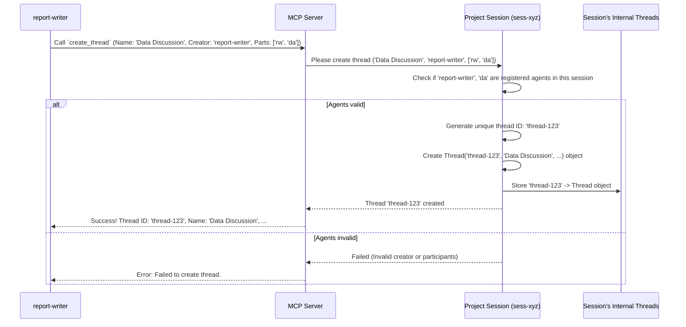

# Chapter 4: Thread

In the [previous chapter](03_session_manager_.md), we learned about the [Session Manager](03_session_manager_.md), the "building manager" that creates and keeps track of all the private "project rooms" ([Session](02_session_.md)s). We know that [Agent](01_agent_.md)s register within a specific [Session](02_session_.md) to join a particular project or task.

But what happens *inside* that project room ([Session](02_session_.md))? Imagine a busy team working together. They don't just have one big, continuous conversation about everything! They might have:

*   A meeting specifically about planning the next steps.
*   A shared document where they draft a report together.
*   A quick chat channel to ask technical questions.

How do we organize these different activities and conversations *within* the same project room ([Session](02_session_.md))? That's where the **Thread** comes in.

## What is a Thread?

Think of a **Thread** as a **specific conversation topic, task, or collaboration context** *inside* a [Session](02_session_.md). It's like:

*   A dedicated **chat channel** in Slack (e.g., `#project-planning`, `#bug-reports`).
*   A specific **meeting** with a defined agenda and attendee list.
*   A **shared document** focused on a particular section of a report.

A Thread helps to:

1.  **Group Related Messages:** All [Message](05_message_.md)s about a specific topic stay together within that Thread.
2.  **Define Participants:** It keeps track of exactly which [Agent](01_agent_.md)s are involved in *this specific* conversation or task. Not everyone in the [Session](02_session_.md) needs to be part of every Thread.
3.  **Manage Focus:** Agents can choose which Threads to participate in, keeping their work organized.

Each Thread has its own key properties:

*   **ID (`threadId`)**: A unique identifier for this specific thread (like a channel ID or meeting link).
*   **Name (`threadName`)**: A human-friendly name describing the thread's purpose (e.g., "Weekly Report Draft", "Analyze Customer Feedback").
*   **Creator (`creatorId`)**: The ID of the [Agent](01_agent_.md) who started this thread.
*   **Participants (`participants`)**: A list of IDs of the [Agent](01_agent_.md)s currently part of this thread.
*   **Messages (`messages`)**: The list of [Message](05_message_.md)s exchanged within this thread (we'll cover Messages in the [next chapter](05_message_.md)).
*   **Status (`isClosed`, `summary`)**: Indicates if the thread is finished and potentially holds a concluding summary.

Here's how a Thread looks in the code:

```kotlin
// From: src/main/kotlin/org/coralprotocol/coralserver/models/ThreadModels.kt

@Serializable // Makes this data structure sendable
data class Thread(
    val id: String = UUID.randomUUID().toString(), // Auto-generated unique ID
    val name: String,                               // Name of the thread
    val creatorId: String,                          // ID of the agent who made it
    val participants: MutableList<String> = mutableListOf(), // List of agent IDs in the thread
    val messages: MutableList<Message> = mutableListOf(),    // List of messages (Chapter 5)
    var isClosed: Boolean = false,                  // Is the conversation finished?
    var summary: String? = null                     // Optional final summary
)
```

This blueprint defines what information each `Thread` object holds. It gets a unique `id` automatically, stores its `name`, `creatorId`, the list of `participants`, and eventually the `messages`.

## Using Threads: Starting and Managing Conversations

Agents interact with Threads using specific [Tool](06_tool_.md)s. Let's see how.

### 1. Creating a New Thread

Imagine two agents, `report-writer` and `data-analyzer`, are inside a [Session](02_session_.md) for creating a sales report. The `report-writer` decides they need a dedicated space to discuss which data sources to use. It can create a new Thread for this.

To do this, an agent uses the `create_thread` [Tool](06_tool_.md). It needs to provide:

*   The desired name for the thread.
*   Its own agent ID (as the creator).
*   A list of initial participant agent IDs.

Here's the kind of information the `create_thread` tool expects:

```kotlin
// From: src/main/kotlin/org/coralprotocol/coralserver/ThreadInputs.kt

@Serializable // Makes this data structure sendable
data class CreateThreadInput(
    val threadName: String,        // e.g., "Data Source Discussion"
    val creatorId: String,         // e.g., "report-writer"
    val participantIds: List<String> // e.g., ["report-writer", "data-analyzer"]
)
```

So, the `report-writer` agent would call the `create_thread` tool with:

*   `threadName`: "Data Source Discussion"
*   `creatorId`: "report-writer"
*   `participantIds`: ["report-writer", "data-analyzer"]

**What happens?**

The system (specifically the [Session](02_session_.md) object) receives this request, checks if the creator and participants are valid agents registered in this Session, creates a new `Thread` object with a unique ID, and adds it to the Session's list of threads. It then sends back a confirmation, often including the details of the newly created thread, like its ID.

```text
// Example Output (Conceptual)
Thread created successfully:
ID: thread-f4b1a2c3
Name: Data Source Discussion
Creator: report-writer
Participants: report-writer, data-analyzer
```

Now, `report-writer` and `data-analyzer` have a dedicated space (`thread-f4b1a2c3`) to discuss data sources!

### 2. Adding or Removing Participants

Later, the `report-writer` realizes they need input from the `editor-bot` agent in the "Data Source Discussion". They can add `editor-bot` to the existing thread.

*   **Adding:** Use the `add_participant` [Tool](06_tool_.md). Needs `threadId` and the `participantId` to add.
*   **Removing:** Use the `remove_participant` [Tool](06_tool_.md). Needs `threadId` and the `participantId` to remove.

Here's the input structure for adding:

```kotlin
// From: src/main/kotlin/org/coralprotocol/coralserver/ThreadInputs.kt

@Serializable
data class AddParticipantInput(
    val threadId: String,      // e.g., "thread-f4b1a2c3"
    val participantId: String  // e.g., "editor-bot"
)
```

The `report-writer` calls `add_participant` with `threadId: "thread-f4b1a2c3"` and `participantId: "editor-bot"`.

**What happens?**

The [Session](02_session_.md) finds the specified thread (`thread-f4b1a2c3`), checks if the `editor-bot` agent exists in the Session, and if the thread isn't closed, adds "editor-bot" to the thread's `participants` list. It then sends back a success message.

```text
// Example Output (Conceptual)
Participant added successfully to thread thread-f4b1a2c3
```

Similarly, `remove_participant` would remove an agent from the list.

### 3. Sending Messages (Preview)

Once a thread exists and has participants, agents can send [Message](05_message_.md)s *within* that thread. This is the core of the collaboration! We'll cover exactly how messages work in the [next chapter](05_message_.md), but just know that messages are always associated with a specific `threadId`.

### 4. Closing a Thread

When the discussion or task within a thread is complete, it can be closed. For example, once the agents agree on the data sources, the `report-writer` might close the "Data Source Discussion" thread.

Agents use the `close_thread` [Tool](06_tool_.md). It requires:

*   The `threadId` to close.
*   A `summary` of the discussion or outcome.

Here's the input structure:

```kotlin
// From: src/main/kotlin/org/coralprotocol/coralserver/ThreadInputs.kt

@Serializable
data class CloseThreadInput(
    val threadId: String, // e.g., "thread-f4b1a2c3"
    val summary: String   // e.g., "Agreed on using Q4 sales data and customer survey results."
)
```

The `report-writer` calls `close_thread` with the `threadId` and the summary.

**What happens?**

The [Session](02_session_.md) finds the thread, marks it as `isClosed = true`, and stores the provided `summary`. This prevents new participants from being added and might signal to agents that this conversation is finished. A confirmation is sent back.

```text
// Example Output (Conceptual)
Thread closed successfully with summary: Agreed on using Q4 sales data and customer survey results.
```

## Under the Hood: How Threads are Managed

Threads don't exist in isolation; they are managed *within* their parent [Session](02_session_.md).

**Creating a Thread - Step-by-Step:**

1.  **Agent Request:** An [Agent](01_agent_.md) (e.g., `report-writer`) calls the `create_thread` [Tool](06_tool_.md) via its connection to the [MCP Server](07_mcp_server_.md). The request includes the thread name, creator ID, and participant IDs.
2.  **Find Session:** The server uses the connection information (which includes the `sessionId`) to ask the [Session Manager](03_session_manager_.md) for the correct [Session](02_session_.md) object.
3.  **Session Handles Creation:** The `create_thread` tool's logic (running within the server context) calls the `createThread` function *on the specific Session object*.
4.  **Validate Participants:** The `Session` object checks its internal list of registered agents to ensure the `creatorId` and all `participantIds` actually exist within *this* Session.
5.  **Create Thread Object:** If validation passes, the `Session` creates a new `Thread` object, giving it a unique `threadId` and filling in the name, creator, and participants.
6.  **Store Thread:** The `Session` stores this new `Thread` object in its internal list (usually a map) of threads.
7.  **Confirmation:** The `Session` signals success back to the tool logic, which then sends a confirmation message back to the originating Agent.

Here's a diagram showing the flow:



**Code Dive:**

The logic for managing threads lives inside the `Session.kt` file. The `Session` class holds a map to store its threads, similar to how it stores registered agents.

```kotlin
// Simplified from: src/main/kotlin/org/coralprotocol/coralserver/session/Session.kt

import org.coralprotocol.coralserver.models.Thread // Needs Thread definition
import org.coralprotocol.coralserver.models.Agent // Needs Agent definition
import java.util.concurrent.ConcurrentHashMap // Safe storage

class Session(/*...*/) {
    // Stores agents registered *in this session*
    private val agents = ConcurrentHashMap<String, Agent>()
    // Stores threads created *in this session*: maps unique Thread ID to Thread object
    private val threads = ConcurrentHashMap<String, Thread>()

    // Creates a new thread within this session
    fun createThread(name: String, creatorId: String, participantIds: List<String>): Thread? {
        // 1. Verify creator exists in this session's agents list
        if (!agents.containsKey(creatorId)) {
            return null // Creator not registered here!
        }

        // 2. Verify all participants exist in this session's agents list
        val validParticipants = participantIds.filter { agents.containsKey(it) }.toMutableList()
        // Add creator if not already listed
        if (!validParticipants.contains(creatorId)) {
            validParticipants.add(creatorId)
        }

        // 3. Create the Thread object (ID is auto-generated inside Thread)
        val thread = Thread(
            name = name,
            creatorId = creatorId,
            participants = validParticipants
        )

        // 4. Store the new thread in this session's internal map
        threads[thread.id] = thread
        return thread // Return the newly created thread
    }

    // ... functions for getThread, addParticipant, removeParticipant, closeThread ...
    // ... These functions would similarly look up the threadId in the 'threads' map
    // ... and then modify the found Thread object (e.g., add to participants list)
}
```

This `createThread` function inside the `Session` class does the heavy lifting: it checks if the agents involved are legitimate members of *this specific session*, creates the `Thread` object, and stores it in the `threads` map, keyed by the thread's unique ID.

The different [Tool](06_tool_.md)s (`create_thread`, `add_participant`, etc.) essentially parse the incoming request arguments and then call the corresponding function on the appropriate `Session` object.

```kotlin
// Simplified concept from: src/main/kotlin/org/coralprotocol/coralserver/tools/CreateThreadTool.kt

// Inside the `create_thread` tool logic...
tool("create_thread") { request -> // When the tool is called
    // 1. Get thread details (name, creator, participants) from the request
    val input = parseThreadDetails(request.arguments)

    // 2. Find the correct Session for this request (using session ID from context)
    val session = findMySession() // Gets the Session object

    // 3. Ask the session to create the thread
    val thread = session.createThread(
        name = input.threadName,
        creatorId = input.creatorId,
        participantIds = input.participantIds
    )

    // 4. Send back a success or failure message
    if (thread != null) {
        return successMessage("Thread created: ID=${thread.id}, Name=${thread.name}...")
    } else {
        return failureMessage("Failed to create thread (invalid agents?)")
    }
}
```

## Conclusion

You've now learned about **Threads**, the way conversations and collaborative tasks are organized *within* a [Session](02_session_.md).

*   A **Thread** is like a specific **chat channel, meeting, or shared document** inside the main project room ([Session](02_session_.md)).
*   It groups related **[Message](05_message_.md)s** and manages a specific list of **participant [Agent](01_agent_.md)s**.
*   Agents use [Tool](06_tool_.md)s like `create_thread`, `add_participant`, `remove_participant`, and `close_thread` to manage threads.
*   Each Thread has a unique **ID**, a **name**, a **creator**, and a list of **participants**.
*   Threads are created and managed *by* the [Session](02_session_.md) they belong to.

Threads provide the necessary structure for focused collaboration. Now that we know how to create these conversation spaces, let's look at what goes inside them: the actual communication.

Next: [Chapter 5: Message](05_message_.md)

---
