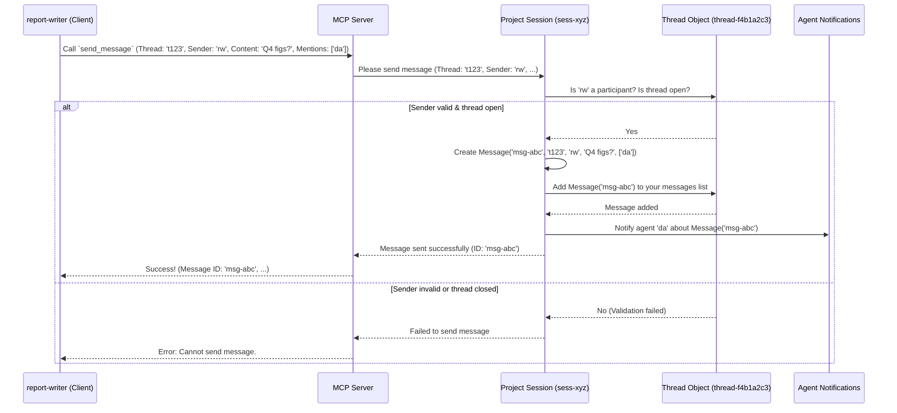
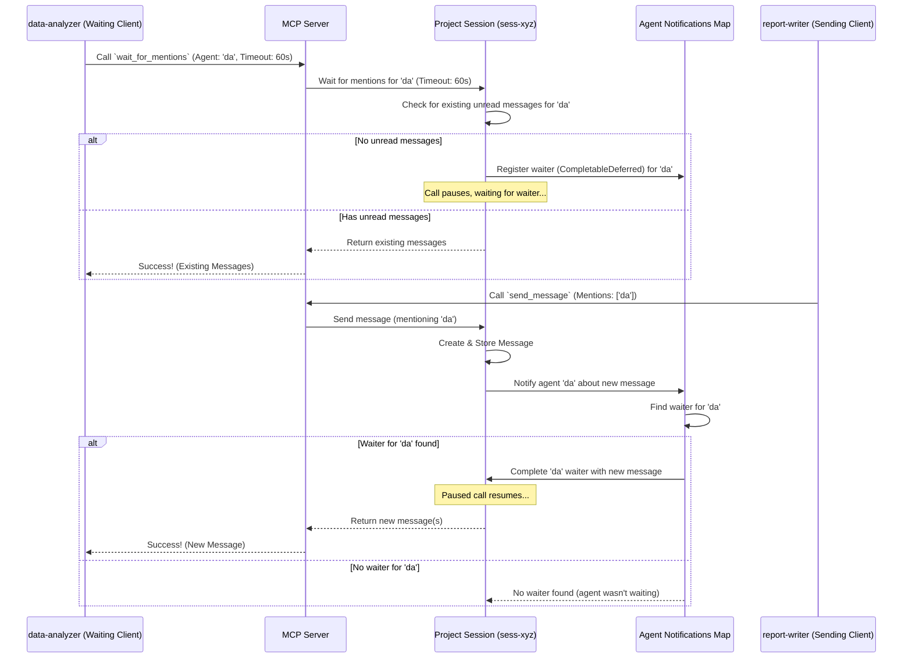

# Chapter 5: Message

In the [previous chapter](04_thread_.md), we learned about **[Thread](04_thread_.md)s**, the dedicated conversation channels or task spaces within a [Session](02_session_.md). We saw how [Agent](01_agent_.md)s can create threads and manage who participates.

But how do the agents actually *talk* within these threads? If our `report-writer` and `data-analyzer` agents have created a "Data Source Discussion" thread, how does the `report-writer` ask the `data-analyzer` which data to use? And how does the `data-analyzer` know it's been asked?

This is where the **Message** comes in – the fundamental unit of communication.

## What is a Message?

Think of a **Message** as a **single entry in a conversation** within a specific [Thread](04_thread_.md). It's like:

*   A specific **comment** on a shared document.
*   An individual **email** in an email chain.
*   A single **chat message** in a chat room or channel.

Each Message carries the actual content being communicated, along with important context.

## Key Properties of a Message

Every message needs a few key pieces of information to make sense:

1.  **ID (`id`)**: A unique identifier for this specific message, like a tracking number for a package.
2.  **Thread ID (`threadId`)**: Tells us *which* [Thread](04_thread_.md) (conversation) this message belongs to.
3.  **Sender ID (`senderId`)**: Tells us *which* [Agent](01_agent_.md) sent this message.
4.  **Content (`content`)**: The actual text, data, or information being communicated. This is the core payload of the message.
5.  **Timestamp (`timestamp`)**: Records *when* the message was sent, helping to keep the conversation in order.
6.  **Mentions (`mentions`)**: An optional list of [Agent](01_agent_.md) IDs that are specifically being "tagged" or notified by this message. Think of this like using "@" in a chat app (e.g., "@data-analyzer, can you provide the sales figures?"). This is crucial for getting specific agents' attention.

Here's how the `Message` data structure looks in the code:

```kotlin
// From: src/main/kotlin/org/coralprotocol/coralserver/models/ThreadModels.kt

@Serializable // Makes this data structure sendable
data class Message(
    val id: String = UUID.randomUUID().toString(), // Auto-generated unique ID
    val threadId: String,          // Which thread it's in
    val senderId: String,          // Who sent it
    val content: String,           // The message text/data
    val timestamp: Long = System.currentTimeMillis(), // When it was sent
    val mentions: List<String> = emptyList() // List of mentioned agent IDs
)
```

This code defines the blueprint for `Message` objects. Each message will have these fields, ensuring all necessary context is captured.

## How Agents Use Messages

Agents interact with messages primarily in two ways: sending them and waiting for them.

### 1. Sending a Message

Let's say our `report-writer` agent needs the Q4 sales figures from the `data-analyzer` agent within their "Data Source Discussion" thread (`thread-f4b1a2c3`). The `report-writer` needs to send a message to that thread and specifically mention the `data-analyzer` to get its attention.

To do this, the agent uses the `send_message` [Tool](06_tool_.md). It needs to provide:

*   The `threadId` of the conversation.
*   Its own `agentId` (as the sender).
*   The `content` of the message.
*   A list of `mentions` (the IDs of agents to notify).

Here's the structure the `send_message` tool expects:

```kotlin
// From: src/main/kotlin/org/coralprotocol/coralserver/ThreadInputs.kt

@Serializable
data class SendMessageInput(
    val threadId: String,       // e.g., "thread-f4b1a2c3"
    val senderId: String,       // e.g., "report-writer"
    val content: String,        // e.g., "What were the final Q4 sales figures?"
    val mentions: List<String> = emptyList() // e.g., ["data-analyzer"]
)
```

So, the `report-writer` agent would call the `send_message` tool with arguments like this (conceptually):

```json
{
  "threadId": "thread-f4b1a2c3",
  "senderId": "report-writer",
  "content": "What were the final Q4 sales figures?",
  "mentions": ["data-analyzer"]
}
```

**What happens?**

The system receives this request, finds the correct [Session](02_session_.md) and [Thread](04_thread_.md), validates that `report-writer` is allowed to post in this thread, creates a new `Message` object, adds it to the thread's message history, and notifies the mentioned agent (`data-analyzer`). It then sends back a confirmation to the `report-writer`.

```text
// Example Output (Conceptual)
Message sent successfully:
ID: msg-a1b2c3d4
Thread: thread-f4b1a2c3
Sender: report-writer
Content: What were the final Q4 sales figures?
Mentions: data-analyzer
```

Now the message is stored in the thread, and crucially, the `data-analyzer` agent has been notified.

### 2. Waiting for Messages (Mentions)

How does the `data-analyzer` agent know it has been asked a question? It needs to actively listen or "wait" for messages that mention it.

Agents use the `wait_for_mentions` [Tool](06_tool_.md) for this. It requires:

*   The `agentId` of the agent that is waiting.
*   An optional `timeoutMs` specifying how long to wait (in milliseconds) before giving up if no messages arrive.

Here's the input structure:

```kotlin
// From: src/main/kotlin/org/coralprotocol/coralserver/ThreadInputs.kt

@Serializable
data class WaitForMentionsInput(
    val agentId: String,        // e.g., "data-analyzer"
    val timeoutMs: Long = 30000 // Default 30 seconds
)
```

The `data-analyzer` agent calls the `wait_for_mentions` tool with arguments like this (conceptually):

```json
{
  "agentId": "data-analyzer",
  "timeoutMs": 60000 // Wait for up to 60 seconds
}
```

**What happens?**

The `data-analyzer` agent essentially pauses and waits. The system checks if there are any *new* messages mentioning `data-analyzer` since the last time it checked.

*   **If a message arrives** (like the one from `report-writer`): The system immediately sends that message (or a list of messages if multiple arrived) back to the `data-analyzer`. The `wait_for_mentions` call finishes successfully.
*   **If no message mentioning `data-analyzer` arrives** within the `timeoutMs`: The `wait_for_mentions` call finishes with a message indicating that no new messages were received.

The response containing the messages is often formatted for clarity, perhaps using an XML-like structure:

```xml
<!-- Example Output (Conceptual) -->
<messages>
  <thread id="thread-f4b1a2c3" name="Data Source Discussion">
    <status>open</status>
    <participants>
      <participant id="report-writer" name="Report Writer" />
      <participant id="data-analyzer" name="Data Analyzer" />
      <!-- ... other participants ... -->
    </participants>
    <messages>
      <message id="msg-a1b2c3d4" timestamp="1678886400000">
        <sender id="report-writer" name="Report Writer" />
        <mentions>
          <mention id="data-analyzer" name="Data Analyzer" />
        </mentions>
        <content>What were the final Q4 sales figures?</content>
      </message>
      <!-- ... other messages might arrive too ... -->
    </messages>
  </thread>
</messages>
```

Now the `data-analyzer` has received the message and can process the request!

## Under the Hood: Sending a Message

Let's trace what happens internally when `report-writer` sends its message.

1.  **Agent Calls Tool:** The `report-writer` client sends the `send_message` request (with threadId, senderId, content, mentions) to the [MCP Server](07_mcp_server_.md).
2.  **Find Context:** The Server uses the connection's `sessionId` to get the correct [Session](02_session_.md) object from the [Session Manager](03_session_manager_.md).
3.  **Find Thread & Validate:** The `send_message` tool logic asks the [Session](02_session_.md) object to handle the message. The Session finds the specified [Thread](04_thread_.md) (`thread-f4b1a2c3`) within its internal list of threads. It then checks if the `senderId` (`report-writer`) is actually a participant in that thread and if the thread isn't closed.
4.  **Create & Store Message:** If validation passes, the Session creates a new `Message` object with a unique ID, populating it with the sender, content, timestamp, and validated mentions. It then adds this `Message` object to the `messages` list *inside* the found `Thread` object.
5.  **Notify:** The Session calls an internal function (`notifyMentionedAgents`) to alert any agents (`data-analyzer` in this case) mentioned in the message who might be waiting via `wait_for_mentions`.
6.  **Confirm:** The Session confirms success back to the tool logic, which sends the confirmation reply back to the `report-writer`.

Here's a simplified sequence diagram:



**Code Dive (Sending):**

The core logic for sending a message resides within the `Session` class.

```kotlin
// Simplified from: src/main/kotlin/org/coralprotocol/coralserver/session/Session.kt

// Stores threads created *in this session*
private val threads = ConcurrentHashMap<String, Thread>()
// Stores agents registered *in this session*
private val agents = ConcurrentHashMap<String, Agent>()

// Send a message to a thread within this session
fun sendMessage(threadId: String, senderId: String, content: String, mentions: List<String> = emptyList()): Message? {
    // 1. Find the thread
    val thread = threads[threadId] ?: return null // Thread not found
    // 2. Check if sender exists in this session
    val sender = agents[senderId] ?: return null // Sender not registered

    // 3. Check if thread is closed or sender is not a participant
    if (thread.isClosed || !thread.participants.contains(senderId)) {
        return null // Cannot send
    }

    // 4. Filter mentions to ensure they are valid participants in this thread
    val validMentions = mentions.filter { thread.participants.contains(it) }

    // 5. Create the Message object
    val message = Message(
        threadId = threadId,
        senderId = senderId,
        content = content,
        mentions = validMentions // Use only valid mentions
    )

    // 6. Add the message to the thread's internal list
    thread.messages.add(message)

    // 7. Notify any mentioned agents who might be waiting
    notifyMentionedAgents(message) // We'll look at this next

    return message // Return the created message
}
```

This `sendMessage` function handles finding the thread, validating the sender, creating the `Message` object, adding it to the thread's history, and triggering notifications.

The `send_message` [Tool](06_tool_.md) itself is relatively simple; it parses the input and calls this `session.sendMessage` method.

```kotlin
// Simplified concept from: src/main/kotlin/org/coralprotocol/coralserver/tools/SendMessageTool.kt

tool("send_message") { request -> // When the tool is called
    // 1. Parse input: threadId, senderId, content, mentions
    val input = parseSendMessageDetails(request.arguments)

    // 2. Find the Session associated with this request
    val session = findMySession() // Gets the Session object

    // 3. Ask the Session to send the message
    val message = session.sendMessage(
        threadId = input.threadId,
        senderId = input.senderId,
        content = input.content,
        mentions = input.mentions
    )

    // 4. Send back success or failure response
    if (message != null) {
        return successMessage("Message sent: ID=${message.id}...")
    } else {
        return failureMessage("Failed to send message (invalid thread/sender/closed?).")
    }
}
```

## Under the Hood: Waiting for Messages

The `wait_for_mentions` mechanism is a bit more complex, involving asynchronous waiting.

1.  **Agent Calls Tool:** The `data-analyzer` client calls `wait_for_mentions` (with its `agentId` and timeout) on the [MCP Server](07_mcp_server_.md).
2.  **Find Session:** The Server gets the correct [Session](02_session_.md) object.
3.  **Check Existing Messages:** The `wait_for_mentions` tool logic asks the Session to handle the wait. The Session first checks if there are *already* unread messages waiting for this agent (`data-analyzer`) that mention it. If yes, it returns them immediately.
4.  **Register Waiter:** If no unread messages exist, the Session creates a special "waiter" object (a `CompletableDeferred` in Kotlin). This is like putting up a flag saying, "Agent `data-analyzer` is waiting for messages." This waiter is stored in a map (`agentNotifications`) within the Session, keyed by the agent's ID. The tool call then pauses, waiting for this waiter object to be completed.
5.  **Message Arrives & Notification:** When *another* agent (like `report-writer`) sends a message using `sendMessage`, the `notifyMentionedAgents` function (called at the end of `sendMessage`) checks the `agentNotifications` map. If it finds a waiter registered for a mentioned agent (e.g., `data-analyzer`), it "completes" the waiter object, passing the new message(s) to it.
6.  **Waiter Completes:** Completing the waiter object signals the paused `wait_for_mentions` call to wake up. It receives the message(s) provided by the notification step.
7.  **Return or Timeout:** The tool call returns the received messages to the `data-analyzer`. If the timeout occurred *before* any notification completed the waiter, the call returns an empty list or a timeout indication.

Here's a sequence diagram illustrating the wait and notify flow:



**Code Dive (Waiting & Notifying):**

The `Session` class manages both waiting and notifying.

```kotlin
// Simplified from: src/main/kotlin/org/coralprotocol/coralserver/session/Session.kt
import kotlinx.coroutines.CompletableDeferred
import kotlinx.coroutines.withTimeoutOrNull

// Stores message notifications (waiters) for agents: Agent ID -> Waiter
private val agentNotifications = ConcurrentHashMap<String, CompletableDeferred<List<Message>>>()

// Wait for messages mentioning an agent
suspend fun waitForMentions(agentId: String, timeoutMs: Long): List<Message> {
    // 1. Check if agent exists
    if (!agents.containsKey(agentId)) return emptyList()

    // 2. Check if there are *already* unread messages mentioning this agent
    val unreadMessages = getUnreadMessagesForAgent(agentId) // Helper func (not shown)
    if (unreadMessages.isNotEmpty()) {
        updateLastReadIndices(agentId, unreadMessages) // Mark as read
        return unreadMessages // Return immediately
    }

    // 3. No unread messages, so create a waiter
    val deferred = CompletableDeferred<List<Message>>()
    agentNotifications[agentId] = deferred // Store the waiter

    // 4. Wait for the waiter to be completed OR timeout
    val result = withTimeoutOrNull(timeoutMs) {
        deferred.await() // Pause here until completed or timeout
    } ?: emptyList() // If timeout, result is empty list

    // 5. Clean up the waiter from the map
    agentNotifications.remove(agentId)

    // 6. Mark received messages (if any) as read
    updateLastReadIndices(agentId, result)

    return result // Return the received messages (or empty list)
}

// Notify mentioned agents about a new message (called by sendMessage)
fun notifyMentionedAgents(message: Message) {
    // Consider only explicitly mentioned agents
    message.mentions.forEach { mentionId ->
        // Find the waiter for this mentioned agent, if any
        val deferred = agentNotifications[mentionId]
        // If a waiter exists and it's not already completed...
        if (deferred != null && !deferred.isCompleted) {
            // ...complete the waiter, passing the new message
            deferred.complete(listOf(message)) // This wakes up the waiting agent
        }
    }
    // Note: System messages might notify all participants (logic omitted for simplicity)
}
```

The `waitForMentions` function checks for existing messages, sets up the `CompletableDeferred` waiter if needed, and then waits. The `notifyMentionedAgents` function (called by `sendMessage`) is responsible for finding and completing these waiters when a relevant message arrives.

The `wait_for_mentions` [Tool](06_tool_.md) calls `session.waitForMentions` and then formats the result.

```kotlin
// Simplified concept from: src/main/kotlin/org/coralprotocol/coralserver/tools/WaitForMentionsTool.kt
import org.coralprotocol.coralserver.ThreadTools // For formatting

tool("wait_for_mentions") { request -> // When the tool is called
    // 1. Parse input: agentId, timeoutMs
    val input = parseWaitForMentionsDetails(request.arguments)

    // 2. Find the Session
    val session = findMySession()

    // 3. Ask the Session to wait for mentions (this might pause)
    val messages = session.waitForMentions(
        agentId = input.agentId,
        timeoutMs = input.timeoutMs
    )

    // 4. Format and return the result
    if (messages.isNotEmpty()) {
        // Use a helper to format messages nicely (e.g., as XML)
        val formatted = ThreadTools.formatMessagesAsXml(messages, session)
        return successMessage(formatted)
    } else {
        return successMessage("No new messages received within the timeout period")
    }
}
```

## Conclusion

You've now learned about the **Message**, the core unit of communication in `sessions`.

*   A **Message** is like a single chat entry or email within a specific **[Thread](04_thread_.md)**.
*   It contains the **content**, **sender**, **timestamp**, and belongs to a **thread**.
*   Crucially, messages can include **mentions** to target specific [Agent](01_agent_.md)s.
*   Agents use the `send_message` [Tool](06_tool_.md) to post messages to threads they participate in.
*   Agents use the `wait_for_mentions` [Tool](06_tool_.md) to pause and wait for new messages that specifically mention them.
*   The [Session](02_session_.md) object manages storing messages within threads and handling the notification mechanism for mentions.

Messages are how agents exchange information and coordinate their actions. The tools for sending and waiting for messages are fundamental building blocks for collaboration. Speaking of tools...

Next: [Chapter 6: Tool](06_tool_.md)

---
