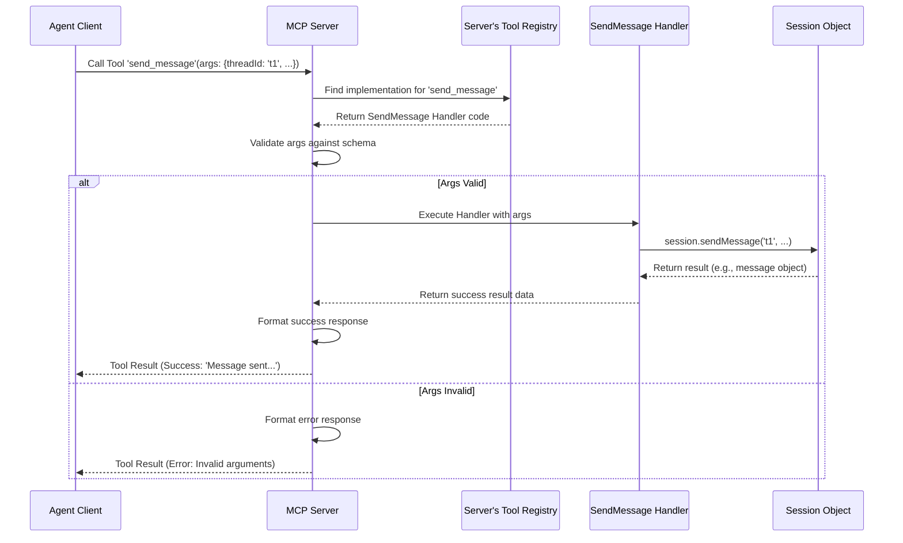

# Chapter 6: Tool

In the [previous chapter](05_message_.md), we saw how [Agent](01_agent_.md)s communicate by sending and receiving **[Message](05_message_.md)s** within specific **[Thread](04_thread_.md)s**. We learned about sending messages with `send_message` and waiting for them with `wait_for_mentions`.

But wait... what exactly are `send_message` and `wait_for_mentions`? We've seen them used, but how does an agent actually *perform* these actions? How does it register itself, create a new thread, or add someone to a conversation?

Agents need a way to interact with the system and make things happen. They need **Tools**.

## What is a Tool?

Imagine you have a smart home system. You can talk to your smart assistant, but to actually turn on the lights, lock the door, or play music, the assistant needs specific commands or "skills". In the `sessions` world, these commands are called **Tools**.

A **Tool** defines a **specific action or capability** that the server makes available for [Agent](01_agent_.md)s to use. Think of them as the buttons or commands an agent can press to interact with the application:

*   Want to join the system? Use the `register_agent` tool.
*   Need to start a new discussion? Use the `create_thread` tool.
*   Want to send a message in that discussion? Use the `send_message` tool.
*   Need to wait for a reply? Use the `wait_for_mentions` tool.

These Tools are the bridge between an [Agent](01_agent_.md) and the server's functionality. Agents don't need to know the complicated details of *how* a message gets stored or how registration is handled internally. They just need to know which tool to call and what information to provide.

## How Tools are Defined

The central server decides which Tools are available. Each Tool is defined with several key pieces of information:

1.  **Name:** A unique, short name used to invoke the tool (e.g., `register_agent`, `send_message`).
2.  **Description:** A human-readable explanation of what the tool does. This helps developers (and sometimes even other AI agents) understand its purpose.
3.  **Input Schema:** Defines exactly what information the tool needs to work. For example, the `send_message` tool needs a `threadId`, `senderId`, `content`, and optional `mentions`. This schema ensures the agent provides the correct arguments.
4.  **Implementation (Handler):** The actual code that runs on the server when the tool is called. This code performs the action (e.g., finding the session, creating the message object, storing it, notifying others).

Let's look at a conceptual example of how the `send_message` tool might be defined on the server using the underlying Model Context Protocol (MCP) library:

```kotlin
// Simplified concept from: src/main/kotlin/org/coralprotocol/coralserver/tools/SendMessageTool.kt

// Inside the server setup...
server.addTool( // Function from the MCP library to define a tool

    // 1. Name used by agents to call the tool
    name = "send_message",

    // 2. Description for understanding the tool's purpose
    description = "Send a message to a thread",

    // 3. Input Schema: Defines required arguments
    inputSchema = Tool.Input( // Structure defining expected input
        properties = mapOf(
            "threadId" to /* Definition for string type */,
            "senderId" to /* Definition for string type */,
            "content" to /* Definition for string type */,
            "mentions" to /* Definition for list of strings (optional) */
        ),
        required = listOf("threadId", "senderId", "content") // These must be provided
    ),

    // 4. Implementation (Handler): The code to run when called
    handler = { request -> // 'request' contains the arguments provided by the agent
        // --- Logic inside the handler ---
        // a. Find the correct Session based on the connection
        val session = server.session // Simplified access to the session

        // b. Parse the arguments provided by the agent
        val input = parseSendMessageArguments(request.arguments) // Extract threadId, senderId, etc.

        // c. Call the session's internal function to do the work
        val message = session.sendMessage(
            threadId = input.threadId,
            senderId = input.senderId,
            content = input.content,
            mentions = input.mentions
        )

        // d. Create a result to send back to the agent
        if (message != null) {
            createSuccessResult("Message sent: ID=${message.id}")
        } else {
            createFailureResult("Failed to send message.")
        }
        // --- End of handler logic ---
    }
)
```

**Explanation:**

*   `addTool`: This is the function (provided by the MCP SDK library used in `sessions`) that registers a new tool with the server.
*   `name`, `description`, `inputSchema`: These define *what* the tool is and *what data* it expects.
*   `handler`: This is a block of code (a lambda function) that gets executed every time an agent calls the `send_message` tool. It takes the `request` (containing the arguments the agent sent), performs the necessary steps (like finding the [Session](02_session_.md) and calling `session.sendMessage`), and returns a result.

Every tool in `sessions` (`register_agent`, `create_thread`, `add_participant`, etc.) is defined in a similar way, each with its own specific name, description, input requirements, and handler logic.

You can see all the tools being added in the `ThreadToolsRegistry.kt` file:

```kotlin
// From: src/main/kotlin/org/coralprotocol/coralserver/tools/ThreadToolsRegistry.kt

package org.coralprotocol.coralserver.tools

import io.modelcontextprotocol.kotlin.sdk.server.Server

/**
 * Extension function to add all thread-based tools to a server.
 */
fun Server.addThreadTools() {
    addRegisterAgentTool()    // Tool from Chapter 1
    addListAgentsTool()       // New tool to list agents
    addCreateThreadTool()     // Tool from Chapter 4
    addAddParticipantTool()   // Tool from Chapter 4
    addRemoveParticipantTool()// Tool from Chapter 4
    addCloseThreadTool()      // Tool from Chapter 4
    addSendMessageTool()      // Tool from Chapter 5
    addWaitForMentionsTool()  // Tool from Chapter 5
}
```

This function simply calls individual functions (`addRegisterAgentTool`, `addSendMessageTool`, etc.) that each contain an `addTool(...)` definition like the one shown conceptually above.

## Using Tools: The Agent's Perspective

From the [Agent](01_agent_.md)'s point of view, using a tool is straightforward. It needs to:

1.  Know the **name** of the tool it wants to use (e.g., `create_thread`).
2.  Know the **required arguments** for that tool (e.g., `threadName`, `creatorId`, `participantIds`).
3.  Format a request according to the Model Context Protocol (MCP), specifying the tool name and arguments.
4.  Send the request to the [MCP Server](07_mcp_server_.md).
5.  Receive the result from the server.

Let's revisit how agents use tools we've already encountered:

*   **Registering:** An agent calls the `register_agent` tool, providing its `agentId`, `agentName`, and `description` as arguments. The server runs the tool's handler, which registers the agent in the appropriate [Session](02_session_.md).
    ```json
    // Agent sends a request like this (conceptually):
    {
      "toolName": "register_agent",
      "arguments": {
        "agentId": "code-gen-bot",
        "agentName": "Code Generator",
        "description": "Generates code snippets"
      }
    }
    // Server responds:
    "Agent registered successfully: Code Generator (code-gen-bot)"
    ```
*   **Sending a Message:** An agent calls the `send_message` tool, providing `threadId`, `senderId`, `content`, and `mentions`. The server's handler finds the thread, adds the message, and notifies mentioned agents.
    ```json
    // Agent sends:
    {
      "toolName": "send_message",
      "arguments": {
        "threadId": "thread-123",
        "senderId": "report-writer",
        "content": "Need Q4 data",
        "mentions": ["data-analyzer"]
      }
    }
    // Server responds:
    "Message sent successfully: ID: msg-abc..."
    ```
*   **Waiting for Mentions:** An agent calls `wait_for_mentions` with its `agentId` and a `timeoutMs`. The handler waits for a relevant message or until the timeout expires.
    ```json
    // Agent sends:
    {
      "toolName": "wait_for_mentions",
      "arguments": {
        "agentId": "data-analyzer",
        "timeoutMs": 30000
      }
    }
    // Server responds (if a message arrives):
    "<messages><thread id='thread-123'>...</thread></messages>"
    // Server responds (if timeout):
    "No new messages received within the timeout period"
    ```

The key takeaway is that the agent interacts with the server's capabilities through these well-defined Tools, without needing direct access to the server's internal workings.

## Under the Hood: How a Tool Call Works

What happens when an agent actually calls a tool? Let's follow the journey of a `send_message` call:

1.  **Agent Prepares:** The [Agent](01_agent_.md) client code decides it needs to send a message. It knows it needs the `send_message` tool and gathers the required arguments (thread ID, sender ID, content, mentions).
2.  **Format Request:** The client formats this information into a standard request message using the Model Context Protocol (MCP). This message clearly states `"toolName": "send_message"` and includes the arguments.
3.  **Send to Server:** The client sends this request over its connection (e.g., [SSE or Stdio](08_transport__sse_stdio__.md)) to the [MCP Server](07_mcp_server_.md).
4.  **Server Receives:** The [MCP Server](07_mcp_server_.md) receives the request.
5.  **Identify Tool:** The server parses the request and sees the agent wants to use the `send_message` tool.
6.  **Lookup Handler:** The server looks up the specific handler function it has registered for the `send_message` tool (like the `handler` block we saw earlier).
7.  **Validate Input:** The server checks if the arguments provided by the agent match the `inputSchema` defined for the `send_message` tool. Are all required arguments present? Are they the correct type (string, list, etc.)?
8.  **Execute Handler:** If the input is valid, the server executes the tool's handler code, passing in the agent's arguments.
9.  **Tool Logic Runs:** The handler code runs. In our `send_message` example, this involves:
    *   Finding the correct [Session](02_session_.md) object.
    *   Calling the `session.sendMessage(...)` method.
    *   This method creates the [Message](05_message_.md) object, stores it in the [Thread](04_thread_.md), and triggers notifications.
10. **Get Result:** The handler code finishes and returns a result (either a success message with the new message ID or an error message).
11. **Format Response:** The server takes this result and formats it into an MCP response message.
12. **Send Response:** The server sends the response back to the agent client over the connection.
13. **Agent Receives:** The agent client receives the response and knows whether its `send_message` call succeeded or failed.

Here's a diagram showing this flow:



This sequence shows how the [MCP Server](07_mcp_server_.md) acts as an intermediary, receiving the agent's request, finding the right tool logic, executing it (which often involves interacting with the [Session](02_session_.md)), and returning the result.

## Conclusion

We've learned about **Tools**, the fundamental way [Agent](01_agent_.md)s interact with the capabilities of the `sessions` server.

*   A **Tool** is a specific **action** or **capability** offered by the server (e.g., `register_agent`, `send_message`, `create_thread`).
*   Each tool has a **name**, **description**, an **input schema** (defining required arguments), and an **implementation** (handler code) that runs on the server.
*   Agents invoke tools by sending requests to the [MCP Server](07_mcp_server_.md), specifying the tool name and arguments.
*   Tools allow agents to perform actions like joining the system, managing conversations, and exchanging information without needing to know the internal server details.

Tools are the verbs of the `sessions` world – they are how agents *do* things.

Now that we understand all the core components – [Agent](01_agent_.md)s, [Session](02_session_.md)s, [Thread](04_thread_.md)s, [Message](05_message_.md)s, and the [Tool](06_tool_.md)s they use – let's look at the central coordinator that manages all these interactions: the [MCP Server](07_mcp_server_.md) itself.

Next: [Chapter 7: MCP Server](07_mcp_server_.md)

---