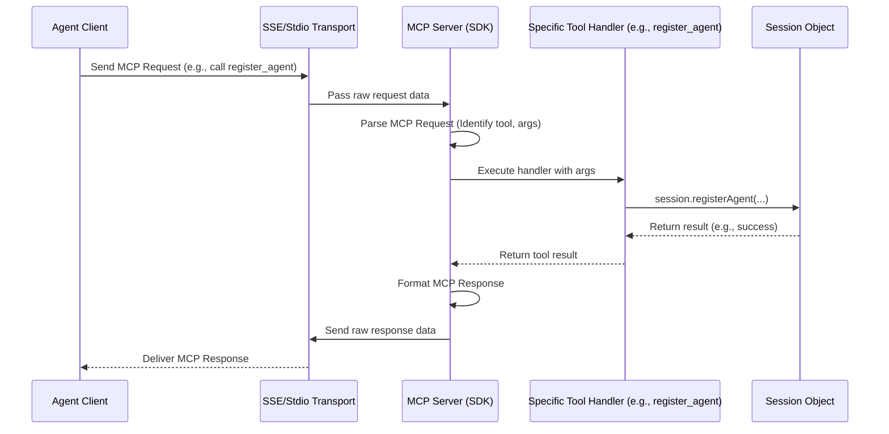

# Chapter 7: MCP Server

In the [previous chapter](06_tool_.md), we explored **[Tool](06_tool_.md)s**, the specific actions like `register_agent` or `send_message` that [Agent](01_agent_.md)s can use to interact with the `sessions` system. We saw how an Agent prepares a request, calls a tool, and gets a result.

But who is listening for these requests? Who actually runs the code for the `register_agent` tool when an Agent calls it? Where do Agents connect in the first place? We need a central component to manage everything.

This central coordinator is the **MCP Server**.

## What is an MCP Server?

Think of the **MCP Server** as the **main engine** or the **operating system** of the entire `sessions` communication platform. It's the core component that:

1.  **Listens for Connections:** It waits for [Agent](01_agent_.md)s (which act as clients) to connect to it.
2.  **Speaks the Protocol:** It understands and enforces the rules of communication defined by the **Model Context Protocol (MCP)**. This protocol is like the grammar and vocabulary that both the server and the agents agree to use.
3.  **Exposes Tools:** It tells connecting [Agent](01_agent_.md)s which [Tool](06_tool_.md)s are available for them to use (like `register_agent`, `send_message`, etc.).
4.  **Handles Requests:** When an [Agent](01_agent_.md) calls a [Tool](06_tool_.md), the MCP Server receives the request, figures out what needs to be done, and executes the corresponding action.
5.  **Routes to Context:** It ensures that requests related to a specific project or task are handled within the correct "project room" or [Session](02_session_.md).

Imagine an air traffic control tower at an airport. The tower (MCP Server) listens for pilots (Agents) wanting to connect. It provides instructions (exposes Tools) on how to land, take off, or taxi. When a pilot requests clearance for takeoff (calls a Tool), the tower processes the request, coordinates with other planes (manages Sessions/Threads), and sends back a confirmation. The tower is the central hub making sure everything runs smoothly according to the rules (MCP).

## Key Responsibilities Explained

Let's break down the MCP Server's job:

*   **Listening for Connections:** The server needs a way to accept incoming connections from agents. This is handled by different communication methods called **Transports**, like using standard input/output (Stdio) or Server-Sent Events (SSE) over the web. We'll learn more about these in the [next chapter](08_transport__sse_stdio__.md). For now, just know the server has an "open door" waiting for agents.
*   **Implementing MCP:** The Model Context Protocol defines the exact format for messages (like tool calls and responses). The MCP Server understands this format, parses incoming messages correctly, and formats outgoing messages according to the protocol rules. It ensures everyone speaks the same language.
*   **Exposing Tools:** When an agent connects, it might ask, "What can I do here?". The MCP Server responds with a list of available [Tool](06_tool_.md)s (like `register_agent`, `create_thread`, etc.), including their descriptions and required inputs.
*   **Handling Requests:** This is the core function. When an agent sends a request like "Use the `register_agent` tool with these details...", the server:
    1.  Receives the raw request data.
    2.  Parses it using the MCP rules.
    3.  Identifies the requested tool (`register_agent`).
    4.  Finds the specific code (the tool's handler) that performs this action.
    5.  Executes that code.
    6.  Gets the result (success or failure).
    7.  Formats the result into an MCP response.
    8.  Sends the response back to the agent.
*   **Routing to Sessions:** Many actions happen within a specific [Session](02_session_.md). The MCP Server works with the [Session Manager](03_session_manager_.md) to find the correct Session for a given request (often based on the connection information or a `sessionId` provided by the agent) and ensures the tool's logic operates on the right data.

## How it Fits Together: An Agent Registers

Let's revisit the scenario from [Chapter 1](01_agent_.md) where a new agent wants to register, but this time focusing on the MCP Server's role.

1.  **Connection:** The Agent client connects to the running MCP Server (using a specific [Transport](08_transport__sse_stdio__.md)). The Server accepts the connection.
2.  **Tool Call:** The Agent sends a message formatted according to MCP rules, essentially saying: `{"toolName": "register_agent", "arguments": {"agentId": "coder-x", "agentName": "Coder Bot", ...}}`.
3.  **Server Receives & Parses:** The MCP Server receives this message and understands it's a request to use the `register_agent` tool with the provided arguments.
4.  **Find Handler:** The Server looks up the specific handler function registered for the `register_agent` [Tool](06_tool_.md).
5.  **Find Session:** The Server determines which [Session](02_session_.md) this agent belongs to (this might be tied to the specific connection endpoint the agent used, or a default session in simple cases). It uses the [Session Manager](03_session_manager_.md) if needed. Let's say it finds `Session('sess-abc')`.
6.  **Execute Logic:** The Server executes the `register_agent` handler. This handler code then calls the `registerAgent` method *on the specific `Session('sess-abc')` object*.
7.  **Session Acts:** The `Session('sess-abc')` object performs the registration logic (checks uniqueness, adds the agent to its internal list).
8.  **Get Result:** The `Session` returns `true` (success) to the handler.
9.  **Format & Send Response:** The handler tells the Server it succeeded. The Server formats an MCP success response (e.g., `"Agent registered successfully: Coder Bot (coder-x)"`) and sends it back to the Agent client.
10. **Agent Receives:** The Agent gets the confirmation message.

The MCP Server orchestrated this whole process, acting as the intermediary between the Agent client and the specific Session where the action needed to happen.

## Under the Hood: Setting Up and Running the Server

The `sessions` project uses a library (`io.modelcontextprotocol.kotlin.sdk`) specifically designed to help create MCP servers. Setting up the server involves creating an instance and telling it which tools it should offer.

**1. Creating the Server Instance:**

There's a helper function that creates the basic server object and adds all the necessary [Tool](06_tool_.md)s we've discussed.

```kotlin
// Simplified from: src/main/kotlin/org/coralprotocol/coralserver/server/McpServer.kt

import io.modelcontextprotocol.kotlin.sdk.server.Server // The base server class from the SDK
import org.coralprotocol.coralserver.tools.addThreadTools // Our function to add tools

/**
 * Configures and returns a new server instance.
 */
fun createCoralMcpServer(): Server {
    // Create a new Server object using the MCP SDK library
    val server = Server(
        // Provide basic info about this server implementation
        Implementation(name = "Coral Server", version = "0.1.0"),
        // Define server capabilities (e.g., supports tools)
        ServerOptions(...)
    )

    // Add all our custom thread-related tools
    server.addThreadTools() // This calls addRegisterAgentTool(), addSendMessageTool(), etc.

    // Return the configured server instance
    return server
}
```

This code uses the `Server` class from the MCP SDK library. It initializes the server with some basic information and then calls `addThreadTools()`, which registers all the tools like `register_agent`, `create_thread`, `send_message`, etc., each with its corresponding handler logic (as shown in [Chapter 6](06_tool_.md)).

**2. Running the Server:**

The `Main.kt` file is the entry point for the application. It decides *how* the server should listen for connections (Stdio or SSE) and starts it.

```kotlin
// Simplified from: src/main/kotlin/org/coralprotocol/coralserver/Main.kt

import org.coralprotocol.coralserver.server.runMcpServerUsingStdio
import org.coralprotocol.coralserver.server.runSseMcpServerWithPlainConfiguration

fun main(args: Array<String>) {
    // Check command line arguments to decide how to run
    val command = args.firstOrNull() ?: "--sse-server" // Default to SSE
    val port = args.getOrNull(1)?.toIntOrNull() ?: 3001 // Default port 3001

    when (command) {
        // Run using Standard Input/Output
        "--stdio" -> runMcpServerUsingStdio()
        // Run using Server-Sent Events over HTTP
        "--sse-server" -> runSseMcpServerWithPlainConfiguration(port)
        else -> {
            println("Unknown command: $command")
        }
    }
}
```

This `main` function checks arguments passed when starting the program. Based on the argument (or default), it calls one of two functions:
*   `runMcpServerUsingStdio()`: Starts the server listening via console input/output.
*   `runSseMcpServerWithPlainConfiguration(port)`: Starts the server listening for web connections (SSE) on a specific port.

These functions (defined in `StdioServer.kt` and `SseServer.kt`) take the server instance created by `createCoralMcpServer()` and connect it to the chosen communication transport. We'll explore these transports in the next chapter.

**3. Handling a Request (Conceptual Flow):**

When a request comes in over the chosen transport:



This diagram shows the MCP Server acting as the central processor. It receives data via the [Transport](08_transport__sse_stdio__.md), parses it according to MCP rules, executes the correct [Tool](06_tool_.md) handler (which interacts with the relevant [Session](02_session_.md)), formats the response, and sends it back via the [Transport](08_transport__sse_stdio__.md).

The `sessions` project leverages the `io.modelcontextprotocol.kotlin.sdk` library to handle much of the complexity of parsing MCP messages, managing tool lifecycles, and handling basic request/response flows. The code in `sessions` focuses on defining the specific Tools and the logic within the `Session` objects.

## Conclusion

You've now learned about the **MCP Server**, the central engine of the `sessions` project.

*   It's the **main coordinator** that implements the **Model Context Protocol (MCP)**.
*   It **listens** for connections from [Agent](01_agent_.md)s.
*   It **exposes** the available [Tool](06_tool_.md)s.
*   It **handles** requests from agents to execute those tools.
*   It **routes** requests to the appropriate [Session](02_session_.md) context.
*   Think of it as the **operating system** or **air traffic controller** managing all communication according to the MCP rules.

The MCP Server brings together all the concepts we've learned – [Agent](01_agent_.md)s connect to it, it manages [Session](02_session_.md)s (via the [Session Manager](03_session_manager_.md)), facilitates communication in [Thread](04_thread_.md)s via [Message](05_message_.md)s, and exposes [Tool](06_tool_.md)s for agents to use.

But how exactly do agents *physically* connect to this server? Let's look at the different ways connections can be established.

Next: [Chapter 8: Transport (SSE/Stdio)](08_transport__sse_stdio__.md)

---