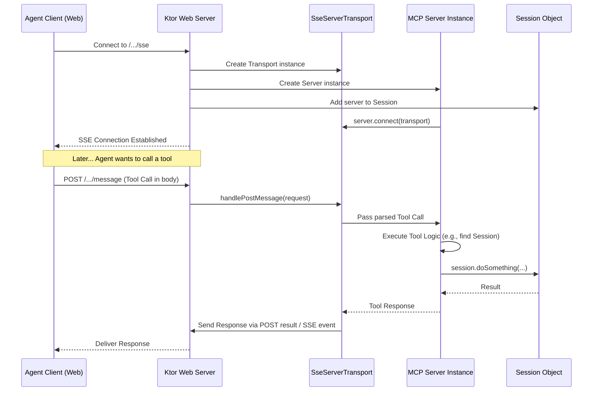
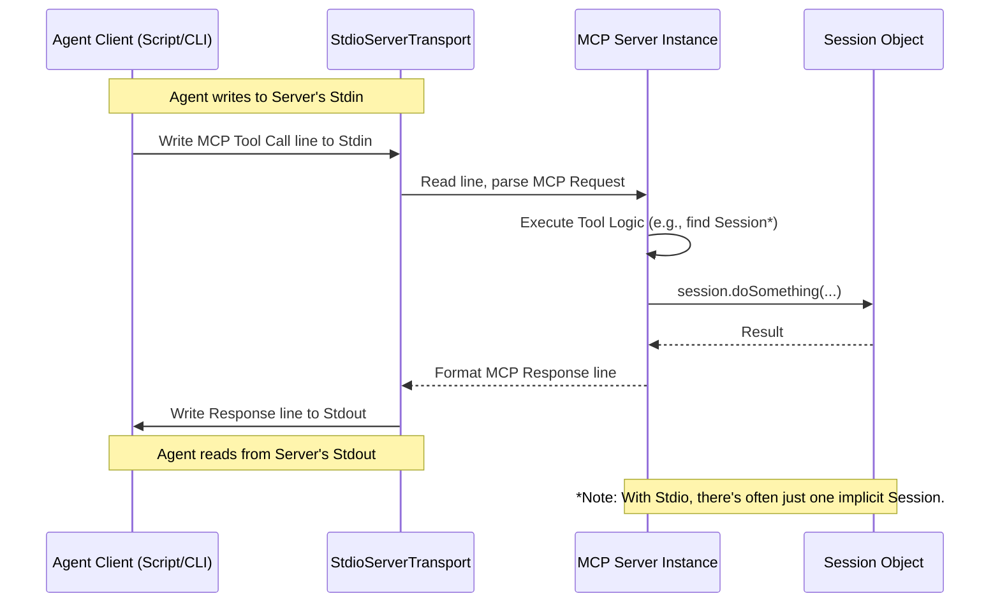

# Chapter 8: Transport (SSE/Stdio)

In the [previous chapter](07_mcp_server_.md), we learned about the [MCP Server](07_mcp_server_.md), the central engine that runs the `sessions` system, listens for requests, and manages communication according to the Model Context Protocol (MCP). We know that [Agent](01_agent_.md)s connect to this server to register, create [Thread](04_thread_.md)s, and send [Message](05_message_.md)s using [Tool](06_tool_.md)s.

But *how* do they actually connect? If the [MCP Server](07_mcp_server_.md) is like an office building, what kind of "door" or "connection method" does an [Agent](01_agent_.md) use to get inside and talk? Does it make a phone call? Send a letter? Connect through a web portal?

This is where the concept of **Transport** comes in. It defines the specific communication pathway used between the [Agent](01_agent_.md) client and the [MCP Server](07_mcp_server_.md).

## What is a Transport?

Think of **Transport** as the **physical method of connection and communication**. It's like choosing how you want to talk to someone:

*   You could have a **live video call** over the internet (persistent, real-time).
*   You could have a **direct conversation** with someone sitting next to you using a simple walkie-talkie (direct input/output).

The *content* of your conversation (the words you say, the information you exchange) might be the same, but the *method* of delivery is different.

In `sessions`, the Transport layer defines *how* the MCP messages (tool calls, responses) are sent back and forth between the agent and the server. It's separate from the *what* (the MCP protocol itself). The `sessions` project supports two main transport methods:

1.  **SSE (Server-Sent Events):** This uses the standard web protocol (HTTP) and is ideal for web browsers or applications communicating over a network. It allows the server to push updates to the agent in real-time. Think of it like getting live notifications on a website or a persistent chat connection in a web app.
2.  **Stdio (Standard Input/Output):** This uses the basic console input and output streams of your computer. It's perfect for command-line agents or simple scripts running locally. Think of it like typing commands directly into a program running in your terminal and seeing its responses printed back.

The [MCP Server](07_mcp_server_.md) is configured to run using *one* of these transport methods at a time. An [Agent](01_agent_.md) client must then use the *same* transport method to connect and communicate.

## Server-Sent Events (SSE) Transport

**Use Case:** Imagine you're building a web application where an AI agent helps a user draft a report. The agent needs to communicate with the `sessions` server running on a machine somewhere else on the network (or the internet). SSE is a great choice here.

**How it Works:**
*   **Connection:** The agent (running in the web browser or a backend service) connects to a specific URL on the [MCP Server](07_mcp_server_.md). This URL usually includes information like the application ID and the [Session](02_session_.md) ID, for example: `http://yourserver:3001/app-id/secret-key/sess-123/sse`.
*   **Communication:** The server keeps this connection open. When something happens that the agent needs to know about (like a new message mentioning it), the server "pushes" an event message down this connection to the agent.
*   **Tool Calls:** When the agent wants to call a [Tool](06_tool_.md) (like `send_message`), it typically makes a standard HTTP POST request to a different, related URL (e.g., `http://yourserver:3001/app-id/secret-key/sess-123/message`). This request contains the tool call details (name and arguments) in its body. The server processes the tool call and might send the result back via the POST response or push an update via the original SSE connection.

**Under the Hood (Server Setup):**

The `sessions` server uses a web framework called Ktor to handle SSE connections. The `runSseMcpServerWithPlainConfiguration` function sets this up.

```kotlin
// Simplified from: src/main/kotlin/org/coralprotocol/coralserver/server/SseServer.kt
import io.ktor.server.application.*
import io.ktor.server.engine.*
import io.ktor.server.routing.*
import io.ktor.server.sse.*
// ... other imports ...

fun runSseMcpServerWithPlainConfiguration(port: Int): Unit = runBlocking {
    // ...
    logger.info { "Starting sse server on port $port ..." }

    // Use Ktor's embeddedServer function to create a web server
    embeddedServer(CIO, host = "0.0.0.0", port = port) {
        // Install the SSE feature into Ktor
        install(SSE)

        // Define the different URL paths (routes) the server responds to
        routing {
            sessionRoutes() // Routes for creating sessions (Chapter 2)
            sseRoutes(servers) // Routes for establishing SSE connections
            messageRoutes(servers) // Routes for receiving tool calls (POST)
        }
    }.start(wait = true) // Start the server and wait
}
```
This code starts a web server that listens on the specified `port`. It enables the SSE feature and sets up different handlers (`sessionRoutes`, `sseRoutes`, `messageRoutes`) for different URL patterns.

**Under the Hood (Handling SSE Connection):**

The `sseRoutes` function defines what happens when a client connects to the `/sse` endpoint.

```kotlin
// Simplified from: src/main/kotlin/org/coralprotocol/coralserver/routes/SseRoutes.kt
import io.ktor.server.routing.*
import io.ktor.server.sse.*
import io.modelcontextprotocol.kotlin.sdk.server.SseServerTransport
import org.coralprotocol.coralserver.server.createCoralMcpServer
// ... other imports ...

fun Routing.sseRoutes(servers: ConcurrentMap<String, Server>) {
    // Handle connections to /{appId}/{key}/{sessionId}/sse
    sse("/{applicationId}/{privacyKey}/{coralSessionId}/sse") {
        // 1. Get parameters from the URL
        val applicationId = call.parameters["applicationId"]
        // ... get privacyKey, sessionId ...

        // 2. Find the Session (using SessionManager - Chapter 3)
        val session = SessionManager.getSession(sessionId)
        // ... validate session and keys ...

        // 3. Create the specific SSE Transport for this connection
        //    The '/message' path is where tool calls will be POSTed
        val transport = SseServerTransport(
            "/$applicationId/$privacyKey/$sessionId/message",
            this // 'this' refers to the current SSE connection context
        )

        // 4. Create a NEW MCP Server instance for this connection
        val server = createCoralMcpServer()

        // 5. Link the server to the session and store it
        session.servers.add(server)
        servers[transport.sessionId] = server // Keep track of active servers

        // 6. Connect the MCP Server logic to this specific transport
        server.connect(transport) // Now this server handles messages on this connection
    }
    // ... includes /devmode endpoint as well ...
}
```
When an agent connects to the SSE URL, this code:
1.  Extracts details like the session ID from the URL.
2.  Finds the corresponding [Session](02_session_.md) object.
3.  Creates an `SseServerTransport` object, which knows how to send/receive MCP messages over this specific SSE connection.
4.  Creates a dedicated [MCP Server](07_mcp_server_.md) instance to handle the logic for *this connection*.
5.  Connects the server instance to the transport instance, effectively activating communication for this agent.

**Under the Hood (Handling Tool Calls via POST):**

The `messageRoutes` function defines the endpoint where agents send their tool calls.

```kotlin
// Simplified from: src/main/kotlin/org/coralprotocol/coralserver/routes/MessageRoutes.kt
import io.ktor.server.routing.*
import io.modelcontextprotocol.kotlin.sdk.server.SseServerTransport
// ... other imports ...

fun Routing.messageRoutes(servers: ConcurrentMap<String, Server>) {
    // Handle POST requests to /{appId}/{key}/{sessionId}/message
    post("/{applicationId}/{privacyKey}/{coralSessionId}/message") {
        // 1. Get parameters and the transport's unique ID (from query param)
        val sessionId = call.parameters["coralSessionId"]
        val transportSessionId = call.request.queryParameters["sessionId"]
        // ... validation ...

        // 2. Find the correct Session
        val session = SessionManager.getSession(sessionId)
        // ... validation ...

        // 3. Find the specific SseServerTransport instance for this connection
        val transport = servers[transportSessionId]?.transport as? SseServerTransport
        // ... handle if not found ...

        // 4. Pass the incoming request to the transport to handle
        //    The transport knows how to parse the MCP tool call from the POST body
        //    and forward it to the connected MCP Server instance.
        transport.handlePostMessage(call)
    }
    // ... includes /devmode endpoint as well ...
}
```
When an agent sends a tool call via HTTP POST to the `/message` URL:
1.  This code extracts identifying information.
2.  It finds the specific `SseServerTransport` instance that corresponds to the agent's original SSE connection (using the `transportSessionId`).
3.  It passes the entire request (`call`) to the `transport.handlePostMessage` method. This method extracts the MCP tool call from the request body and gives it to the associated [MCP Server](07_mcp_server_.md) instance to execute the correct [Tool](06_tool_.md).

**SSE Flow Diagram:**



## Standard Input/Output (Stdio) Transport

**Use Case:** Imagine you're writing a simple command-line script in Python or Bash that needs to interact with the `sessions` server running on the *same machine*. You don't need web protocols; you just want the script to talk directly to the server process. Stdio is perfect for this.

**How it Works:**
*   **Connection:** When the [MCP Server](07_mcp_server_.md) is started with the `--stdio` option, it doesn't listen on the network. Instead, it listens to its standard input stream (usually the keyboard input in the terminal where it was started) and writes to its standard output stream (usually the terminal screen).
*   **Communication:** The agent script connects to the server process. It writes its MCP tool call messages as lines of text to the server's standard input. The server reads these lines, processes them, and writes the MCP response messages back as lines of text to its standard output, which the agent script then reads.

**Under the Hood (Server Setup):**

The `runMcpServerUsingStdio` function sets up this mode.

```kotlin
// Simplified from: src/main/kotlin/org/coralprotocol/coralserver/server/StdioServer.kt
import io.modelcontextprotocol.kotlin.sdk.server.StdioServerTransport
import kotlinx.coroutines.runBlocking
import kotlinx.io.asSink
import kotlinx.io.asSource
import kotlinx.io.buffered
// ... other imports ...

fun runMcpServerUsingStdio() {
    logger.info { "Starting MCP server using Stdio..." }

    // 1. Create the main MCP Server logic (same as for SSE)
    val server = createCoralMcpServer()

    // 2. Create the Stdio Transport, telling it to use
    //    the system's standard input and output streams.
    val transport = StdioServerTransport(
        inputStream = System.`in`.asSource().buffered(), // Read from console input
        outputStream = System.out.asSink().buffered() // Write to console output
    )

    runBlocking {
        // 3. Connect the MCP server logic to the Stdio transport
        server.connect(transport) // Start listening/writing to stdio
        logger.info { "Stdio server connected. Waiting for input..." }
        // Keep the server running indefinitely (simplified)
        kotlinx.coroutines.delay(Long.MAX_VALUE)
    }
}
```
This code is much simpler for Stdio:
1.  It creates the same core [MCP Server](07_mcp_server_.md) logic.
2.  It creates a `StdioServerTransport`, specifically telling it to use `System.in` (standard input) and `System.out` (standard output).
3.  It connects the server to the transport. Now, the server will automatically read MCP messages line-by-line from standard input, process them using the appropriate [Tool](06_tool_.md) handler, and write the MCP responses line-by-line back to standard output.

**Stdio Flow Diagram:**



## Choosing the Right Transport

*   Use **SSE** when:
    *   Your agent is a web application (JavaScript in a browser).
    *   Your agent is a separate service communicating with the server over a network.
    *   You need real-time updates pushed from the server.
*   Use **Stdio** when:
    *   Your agent is a simple command-line script or tool.
    *   The agent and server are running on the same machine.
    *   You're doing local development or testing and don't need network complexity.

The beauty is that the core logic of your agents and the server's [Tool](06_tool_.md)s remain the same, regardless of the transport chosen. You just change the connection mechanism.

## Conclusion

In this chapter, we learned about the **Transport** layer, which defines *how* an [Agent](01_agent_.md) connects and communicates with the [MCP Server](07_mcp_server_.md).

*   **Transport** is the physical communication method (like a phone line or web chat).
*   **SSE (Server-Sent Events)** uses HTTP for web-based, real-time communication over a network.
*   **Stdio (Standard Input/Output)** uses direct console streams for simple, local communication.
*   The [MCP Server](07_mcp_server_.md) is started with either SSE or Stdio, and the [Agent](01_agent_.md) must connect using the matching method.
*   The underlying MCP protocol and the core logic ([Agent](01_agent_.md)s, [Session](02_session_.md)s, [Thread](04_thread_.md)s, [Message](05_message_.md)s, [Tool](06_tool_.md)s) remain the same regardless of the transport.

Understanding the transport options helps you choose the right way to connect your agents to the `sessions` system based on your specific needs.

This chapter concludes our tour of the core concepts in the `sessions` project! You've learned about the individual [Agent](01_agent_.md)s, the isolated [Session](02_session_.md)s they work within, the [Session Manager](03_session_manager_.md) that oversees them, the conversational [Thread](04_thread_.md)s, the [Message](05_message_.md)s they exchange, the [Tool](06_tool_.md)s they use to interact, the central [MCP Server](07_mcp_server_.md) orchestrating everything, and finally, the [Transport](08_transport__sse_stdio__.md) methods for connection. You now have a solid foundation for understanding and building collaborative AI applications with `sessions`!

---
