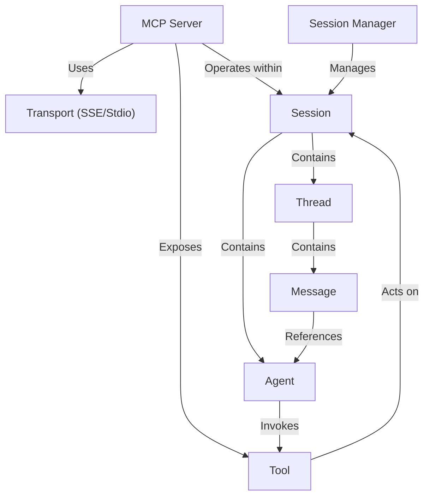

# Tutorial: sessions

This project provides a server for **multi-agent communication** based on the *Model Context Protocol (MCP)*.
Think of it as a central hub where different AI **Agents** can connect and collaborate.
Agents join a specific **Session**, which is like a private workspace. Inside a Session, they can start or join **Threads** (conversations) and exchange **Messages**.
The server exposes **Tools** (like `register_agent`, `send_message`) that Agents use to interact.
Communication happens over different **Transports** (like web-based SSE or command-line Stdio). The **Session Manager** handles creating and finding the right workspace (Session) for each Agent connection.

**Source Repository:** [https://github.com/Coral-Protocol/coral-server/tree/sessions](https://github.com/Coral-Protocol/coral-server/tree/sessions)

## Chapters

1. [Agent
](01_agent_.md)
2. [Session
](02_session_.md)
3. [Session Manager
](03_session_manager_.md)
4. [Thread
](04_thread_.md)
5. [Message
](05_message_.md)
6. [Tool
](06_tool_.md)
7. [MCP Server
](07_mcp_server_.md)
8. [Transport (SSE/Stdio)
](08_transport__sse_stdio__.md)

---
